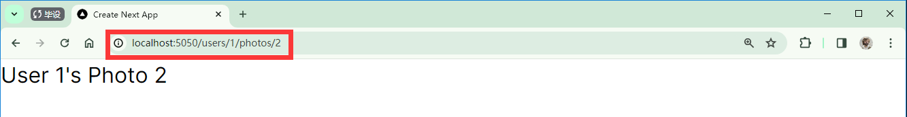
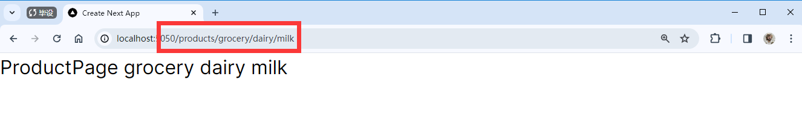

---
last_update:
  date: 23 Feb 2024 GMT
  author: Casta-mere
---

# 路由与跳转

本篇包括以下内容:

- Define dynamic routes
- Access route and query string parameters
- Create layouts
- Show loding UIs
- Handle errors

## Routing Overview

前面提到过，在 Next.js 中，依据约定俗成每个文件夹中仅有 page.tsx 会被渲染为公共页面。除此之外 Next.js 中还有其他特殊命名规则文件：

- page.tsx
- layout.tsx
- loading.tsx
- route.tsx
- not-found.tsx
- error.tsx

随着某个 page 里包含的内容越来越多，可以将其中的部分内容封装为 component，并放在同目录下(而不需要放到 component 文件夹里)，以提高结构的可读性和效率

## 动态路由

Typescript 可以直接使用\{\}解构

```jsx showLineNumbers
interface Props {
  id: num;
}
// 可以像 {id}: Props 这样，直接解构出来
const UserDetailPage = ({ id }: Props) => {
  return <div>UserDetailPage</div>;
};
```

动态路由，即可以根据参数进行自动适配的路由。比如想要实现 `user/userid` 这样的路由，就可以使用下面的这种形式。使用中括号将所需的文件夹名包起来

```txt title="文件结构"
users
  │  page.tsx
  │  UserTable.tsx
  │
  └─[id]
          page.tsx
```

```jsx title="users/[id]/page.tsx" showLineNumbers
import React from "react";

interface Props {
  params: { id: number };
}

const UserDetailPage = ({ params: { id } }: Props) => {
  return <div>UserDetailPage {id}</div>;
};

export default UserDetailPage;
```

这样即可使用 `localhost:5050/users/1` 这样的形式来访问


### 嵌套动态路由

比如我们想要实现 `users/userid/photos/photoid` 这样的路由，其中 userid 和 photoid 为变量，也就是实现**动态路由的嵌套**。我们仍然可以使用中括号将两个文件夹都括起来，就像如下的文件结构。

```txt title="文件结构"
users
│  page.tsx
│  UserTable.tsx
│
└─[id]
    │  page.tsx
    │
    └─photos
        └─[photoId]
                page.tsx
```

需要注意的是，变量名(文件夹名，上结构中的 id 和 photoId)不能重复，因为我们在使用时需要直接使用这个变量名来访问

```jsx title="users/[id]/photos/[photoId]/page.tsx" showLineNumbers
import React from "react";

interface Props {
  // 这里的 id 和 photoId 都要和前面文件夹名对应上，才能正确获取到
  // highlight-next-line
  params: { id: number, photoId: number };
}

// 同样可以直接解构使用
const PhotoPage = ({ params: { id, photoId } }: Props) => {
  return (
    <div>
      User {id}'s Photo {photoId}
    </div>
  );
};

export default PhotoPage;
```

以此类推，不管有多少层都可以正常嵌套，注意命名别重复即可



### Catch-all 路由

在 Next.js 中，使用 `[...slug]` 来捕捉多层并生成动态路由的功能被称为 Catch-All 路由。它允许你在路径中捕捉任意数量的片段，并将它们作为参数传递给页面组件

上文说到可以将文件夹名字用 `[]` 包起来来生成动态路由，如果在名字前添加 `...` ，比如 `[...slug]` 即可生成一个 Catch-All 路由。他的作用是，无论你加多少层路由都可以识别出来。比如一般来说，想要实现 `products/grocery/dairy/milk` 这个路由，需要一层一层创建，而使用 Catch-all 路由，只需要创建 products/[...slug]/page.tsx 即可。

```jsx title="products/[...slug]/page.tsx" showLineNumbers
import React from "react";

interface Props {
  // 注意这里的的 slug 类型为 string 数组
  // highlight-next-line
  params: { slug: string[] };
}

const ProductPage = ({ params: { slug } }: Props) => {
  return <div>ProductPage {slug && slug.map((str) => str + " ")}</div>;
};

export default ProductPage;
```

最终呈现的效果如下：



在该例子中，`products` 文件夹下仅有 `[...slug]` 文件夹，并不存在 `page.tsx` ，即直接访问 `localhost:5050/products` 会报 404。如果想要这个 slug 为空也可以正常访问，则可以使用 `[[...slug]]` 的形式命名文件夹，即再套一层中括号。即如下文件层级：

```txt title="文件结构"
products
└─[[...slug]]
        page.tsx
```

最终效果如下。


Catch-All 在多层级的 tag 或者类别中导航十分好用，只需要在页面中提取出 slug 再去数据库获取，渲染即可

## 获取参数

我们经常会在 url 中添加一些参数，比如 `users?sortOrder=name` 这样，用于排序之类的操作。在 Next.js 中也比较简单，这里给一个例子

```jsx showLineNumbers title="users/page.tsx"
import React from "react";
import UserTable from "./UserTable";

// 首先在这里添加可选的参数，比如这里添加一个sortOrder
// highlight-start
interface Props {
  searchParams: { sortOrder: string };
}
// highlight-end

const UserPage = async ({ searchParams: { sortOrder } }: Props) => {
  return (
    <>
      <h1>User</h1>
      <UserTable sortOrder={sortOrder} />
    </>
  );
};

export default UserPage;
```

这样就可以通过 `localhost:5050/users?sortOrder=name` 来传参。

<details>
  <summary>实现排序逻辑(与本章主线无关)</summary>

接下来是实现排序的逻辑，首先安装 [fast-sort npm]

```bash
npm i fast-sort
```

然后在 `users/Usertable.tsx` 中添加逻辑

```jsx showLineNumbers title="users/Usertable.tsx"
import Link from "next/link";
import React from "react";
// 引入 fast-sort
// highlight-next-line
import { sort } from "fast-sort";

interface User {
  id: number;
  name: string;
  email: string;
}

interface Props {
  sortOrder: string;
}

const UserTable = async ({ sortOrder }: Props) => {
  const res = await fetch("https://jsonplaceholder.typicode.com/users");
  const users: User[] = await res.json();

  // 排序
  // highlight-start
  const sortedUsers = sort(users).asc(
    sortOrder === "email" ? (user) => user.email : (user) => user.name
  );
  // highlight-end
  return (
    <>
      <table className="table table-bordered">
        <thead>
          <tr>
            <th>
              <Link href="/users?sortOrder=name">Name</Link>
            </th>
            <th>
              <Link href="/users?sortOrder=email">Email</Link>
            </th>
          </tr>
        </thead>
        <tbody>
          {sortedUsers.map((user) => (
            <tr key={user.id}>
              <td>{user.name}</td>
              <td>{user.email}</td>
            </tr>
          ))}
        </tbody>
      </table>
    </>
  );
};

export default UserTable;
```

</details>

## 布局

上文说到，Next.js 中的 layout.tsx 也是特殊文件，用于布局页面，在某个文件夹下的 layout.tsx 会将其布局应用到其所有的子文件夹中。比如想要在每个页面都添加 NavBar 和 Footer，则只需要根文件夹下的 layout.tsx 中添加即可。用此方法可以减少大量的冗余代码，提升易读性，也更便于后期修改

为某个文件夹创建新的 layout 可以用如下的形式

```jsx title="admin/layout.tsx" showLineNumbers
import React, { ReactNode } from "react";

interface Props {
  // layout 固定需要一个 NeactNode 类型的 children 为参数
  // highlight-next-line
  children: ReactNode;
}

const AdminLayout = ({ children }: Props) => {
  return (
    <div className="flex">
      {/* 这里是 NavBar */}
      <aside className="bg-slate-200 p-5 mr-5">Admin Sidebar</aside> <div>
        {children}
      </div> {/* 渲染 children */}
      {/* 这里还可以加 Footer*/}
    </div>
  );
};

export default AdminLayout;
```

这里是根目录下的 layout 文件，相对会多一些 metadata 之类的内容，无伤大雅，其内容和上面差不多，只不过直接都写到了 `export` 里面，略掉了格式声明

```jsx title="layout.tsx" showLineNumbers
import "./globals.css";
import type { Metadata } from "next";
import { Inter } from "next/font/google";
import NavBar from "./NavBar";

const inter = Inter({ subsets: ["latin"] });

export const metadata: Metadata = {
  title: "Create Next App",
  description: "Generated by create next app",
};

export default function RootLayout({
  children,
}: {
  children: React.ReactNode,
}) {
  return (
    // 主要修改的还是这部分
    // highlight-start
    <html lang="en" data-theme="winter">
      <body className={inter.className}>
        <NavBar />
        <main className="p-5">{children}</main>
      </body>
    </html>
    // highlight-end
  );
}
```

除此之外，在 global.css 中还可以修改对应 tag 的 style

```css title="global.css" showLineNumbers
/*  tailwind 有三个不同层级的样式，作用于不同的域 */
@tailwind base;
@tailwind components;
@tailwind utilities;

:root {
  --foreground-rgb: 0, 0, 0;
}

@media (prefers-color-scheme: dark) {
  :root {
    --foreground-rgb: 255, 255, 255;
  }
}

body {
  color: rgb(var(--foreground-rgb));
}

/*  可以通过@layer base来修改不同层级的样式 */
/*  highlight-start */
@layer base {
  h1 {
    /*  修改全局 h1 的样式 */
    @apply font-extrabold text-2xl mb-3;
  }
}
/*  highlight-end */
```

## 导航

### Link 标签

Link 标签有以下三个特点

- 只下载目标页面的内容(不会重复下载 css, tsx, js 等内容)
- 会预先下载所有 Link 的内容(仅在部署环境中)
- 在客户端缓存页面

### 程序性导航

比如在需要提交表单后跳转的场景，就需要用到 `Button` 来跳转，这个时候就要用到程序性导航，下面是一个示例。首先需要将该组件变为**客户端组件**(因为要获取客户端信息)，然后使用 `next/navigation` 库中的 router 即可实现跳转

```tsx title="app\users\new\page.tsx" showLineNumbers
"use client"; // 改为客户端组件
// 引入 router，注意是 next/navigation 不是 next/router
import { useRouter } from "next/navigation";
import React from "react";

const NewUserPage = () => {
  // 初始化 router
  const router = useRouter();

  return (
    <>
      <div>NewUserPage</div>
      {/* 直接使用router.push() */}
      <button className="btn btn-primary" onClick={() => router.push("/users")}>
        Create
      </button>
    </>
  );
};

export default NewUserPage;
```

## 展示一个 Loading 的 UI

展示一个 loading 的 UI 很简单，如果只有部分需要加载的组件需要这个功能，只需要拿 `Suspense` tag 把它包起来即可，其中 fallback 则是加载中显示的内容

```jsx
// 需要 import 的
import React, { Suspense } from "react";

<Suspense fallback={<p>Loading...</p>}>
  <UserTable sortOrder={sortOrder} />
</Suspense>;
```

上文我们说到 `loading.tsx` 也是特殊文件，如果创建该文件，将直接应用于所有的子文件夹，比如下面这样。并且 [daisyUI Loading] 也有对应的样式

```tsx title="loading.tsx" showLineNumbers
import React from "react";

const Loading = () => {
  return (
    <div className="place-content-center">
      {/* 也有现成的 daisyUI 类可以使用 */}
      <span className="loading loading-infinity loading-lg"></span>
    </div>
  );
};

export default Loading;
```

除此之外，如下图所示使用 chorme 的 React Devtool ，先选中 suspense 标签，然后可以在这里暂停这个网页，从而看到 `suspend` tag 里面的内容，也就是渲染时用户看到的内容。更方便于测试


## 处理 Error

### 404 not Found

在文件夹中添加 `not-found.tsx` 即可(同理也是特殊文件，命名必须一字不差)。也和 layout 那些一样，某个文件夹内的会作用到所有子文件夹内，除非这个文件夹内有自己的 `not-found.tsx`，即可以针对不同的区域设置不同的 404。如 想访问一个不存在的用户和不存在的商品，就可以显示不同的内容

```jsx title="not-found.tsx" showLineNumbers
import React from "react";

const NotFoundPage = () => {
  return <div>The requested page doesn&apos;t exist</div>;
};

export default NotFoundPage;
```

效果如下:


### 其他 Error

其他可能出现的错误就是代码错误了，一些 502、 runtime error 这类的。同样的，添加 `error.tsx` 来捕捉这类问题

```jsx title="error.tsx" showLineNumbers
"use client";
import React from "react";

interface Props {
  error: Error;
  reset: () => void;
}

const ErrorPage = ({ error, reset }: Props) => {
  // 可以打印错误到本地日志，这里的是打印到用户端的 console
  console.log("Error", error);
  return (
    <>
      <div>An unexpected error has occurred</div>
      {/* 可以添加一个重试的 button */}
      <button className="btn" onClick={() => reset()}>
        Retry
      </button>
    </>
  );
};

export default ErrorPage;
```

效果如下:


[fast-sort npm]: https://www.npmjs.com/package/fast-sort
[daisyUI Loading]: https://daisyui.com/components/loading/
