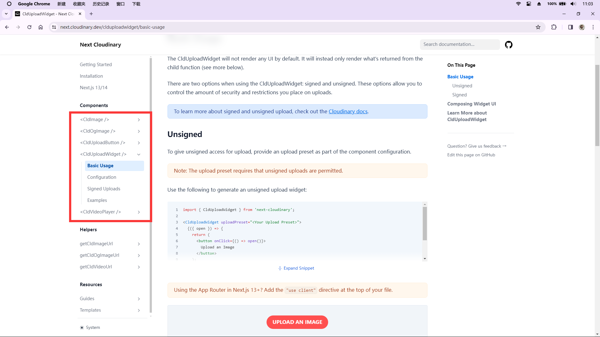
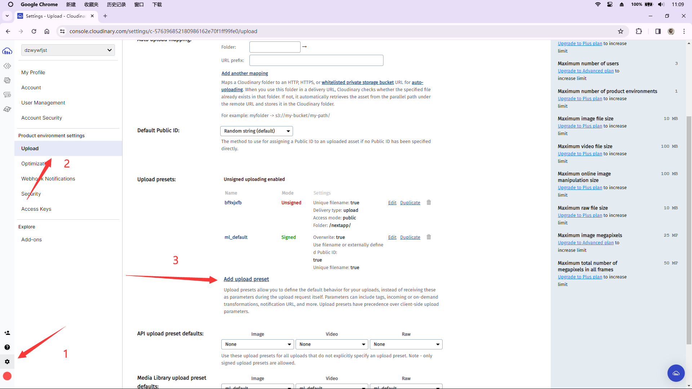
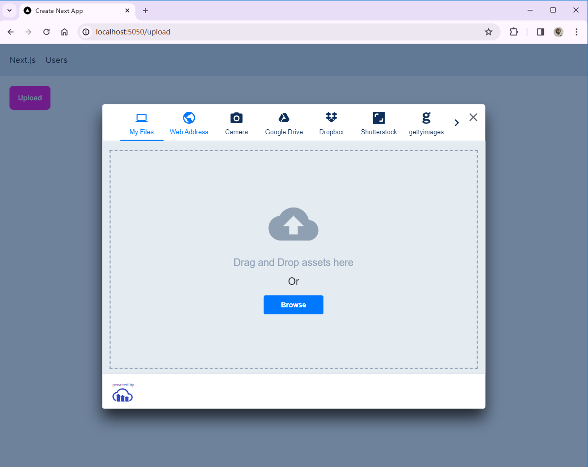
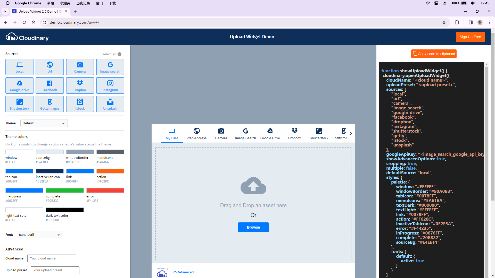

---
last_update:
  date: 26 Feb 2024 GMT
  author: Casta-mere
---

# 上传文件

## 选择云平台

- Amazon S3
- Google Cloud
- Microsoft Azure
- Cloudinary

## Cloudinary 安装与配置

前往[Cloudinary]注册账号，注册好之后使用 `npm i next-cloudinary` 安装。

在 `.env` 文件中添加以下内容

```python title=".env"
# Environment variables declared in this file are automatically made available to Prisma.
# See the documentation for more detail: https://pris.ly/d/prisma-schema#accessing-environment-variables-from-the-schema

# Prisma supports the native connection string format for PostgreSQL, MySQL, SQLite, SQL Server, MongoDB and CockroachDB.
# See the documentation for all the connection string options: https://pris.ly/d/connection-strings

DATABASE_URL="mysql://root:@localhost:3306/nextapp"
# 添加下面这行，并修改为你的 Cloud Name
# highlight-next-line
NEXT_PUBLIC_CLOUDINARY_CLOUD_NAME="<Your Cloud Name>"
```

## 上传文件

[本章代码链接](https://github.com/Casta-mere/Dash-Board/tree/b8ee1d82afe54a244459259f46a4f1e332b5161a)

Cloudinary 内置了几个上传组件供我们使用，在[Cloudinary Widgets]有详细的介绍



创建 `/upload/page.tsx` 并添加以下内容

```tsx title="/upload/page.tsx" showLineNumbers
"use client";
import React from "react";
import { CldUploadWidget } from "next-cloudinary";

const UploadPage = () => {
  return (
    // 这里的 preset 换成你自己的 preset
    // highlight-next-line
    <CldUploadWidget uploadPreset="">
      {({ open }) => (
        <button className="btn btn-secondary" onClick={() => open()}>
          Upload
        </button>
      )}
    </CldUploadWidget>
  );
};
export default UploadPage;
```

其中的 `preset` 需要我们在 Cloudinary 的 settings/upload 中添加，设置好后，复制名字到 `uploadPreset=""` 即可



最终显示效果如下



在[Cloudinary Library]可以查看上传上去的文件

## 展示上传的文件

[本章代码链接](https://github.com/Casta-mere/Dash-Board/tree/043b5ee6be4ada0fa5d4c82de14cc3c9c1e771d0)

可以调用 `CldImage` 组件来显示上传上去的文件。直接使用图片的 `publicID` 即可

```tsx title="/upload/page.tsx" showLineNumbers
"use client";
import React, { useState } from "react";
// import CldImage 用于展示图片
// highlight-next-line
import { CldUploadWidget, CldImage } from "next-cloudinary";

interface CloudinrayResult {
  public_id: string;
}

const UploadPage = () => {
  const [publicId, setPublicId] = useState("");
  return (
    <>
      {publicId && (
        // 若图片Id不为空则渲染图片
        // highlight-next-line
        <CldImage src={publicId} width={270} height={180} alt={"a picture"} />
      )}
      <CldUploadWidget
        uploadPreset="bf9xjxfb"
        onUpload={(result, widget) => {
          if (result.event !== "success") return;
          //   成功上传后修改图片Id
          // highlight-next-line
          const info = result.info as CloudinrayResult;
          // highlight-next-line
          setPublicId(info.public_id);
        }}
      >
        {({ open }) => (
          <button className="btn btn-secondary" onClick={() => open()}>
            Upload
          </button>
        )}
      </CldUploadWidget>
    </>
  );
};
export default UploadPage;
```

## 自定义上传组件

[本章代码链接](https://github.com/Casta-mere/Dash-Board/tree/2ad7a8a65179cde7d3a21cc9c77c3ecb55925812)

在[Cloudinary Demo]可以自定义上传组件，包括颜色，文件来源，是否支持多文件等等



你也可以直接在调用时添加参数:

```tsx title="CldUploadWidget" showLineNumbers
<CldUploadWidget
  uploadPreset="bf9xjxfb"
  // 直接在这里设置
  // highlight-start
  options={{
    sources: ["local"],
  }}
  // highlight-end
  onUpload={(result, widget) => {
    if (result.event !== "success") return;
    const info = result.info as CloudinrayResult;
    setPublicId(info.public_id);
  }}
></CldUploadWidget>
```

[Cloudinary]: https://console.cloudinary.com/
[Cloudinary Widgets]: httpsnext.cloudinary.devclduploadwidgetbasic-usage
[Cloudinary Library]: https://console.cloudinary.com/console/media_library/
[Cloudinary Demo]: https://demo.cloudinary.com/uw/#/
