---
last_update:
  date: 27 Feb 2024 GMT
  author: Casta-mere
---

# 身份验证

本篇包括以下内容:

- Setting up Next Auth
- Configuring the Google Provider
- Authentication sessions
- Protecting routes
- Database adapters
- Configuring the Credentials Provider

## Setting up Next Auth

使用 `npm install next-auth` 安装 Next-Auth(Auth.js)。安装好后首先去 `.env` 中配置环境变量

```python title=".env"
DATABASE_URL="mysql://root:@localhost:3306/nextapp"
NEXT_PUBLIC_CLOUDINARY_CLOUD_NAME="dzwywfjst"
# 添加下面两行
NEXTAUTH_URL=http:localhost:5050 # 你的项目位置
NEXTAUTH_SECRETT=5xNi+cY1LdL1YnBWD9cUi4A34tTZJfUjKTlMCMjFcL0= # 随机数，可以使用 openssl random -base64 32 生成
```

设置完成后，在 api 文件夹下添加 auth/[...nextauth]/route.ts，并添加以下内容，为接下来做准备

```tsx title="api\auth[...nextauth]\route.ts"
import NextAuth from "next-auth/next";

const handler = NextAuth({});

export { handler as GET, handler as POST };
```

## 设置 Provider

在[Next Auth Provider]可以看到 Next-Auth 支持多个 Authenticator Provider，包括 [Google]，[Github]，[Facebook] 等

### 创建项目

此处以 [Google] 为例，首先进入 [Google Credentials] 页面新建一个 Project

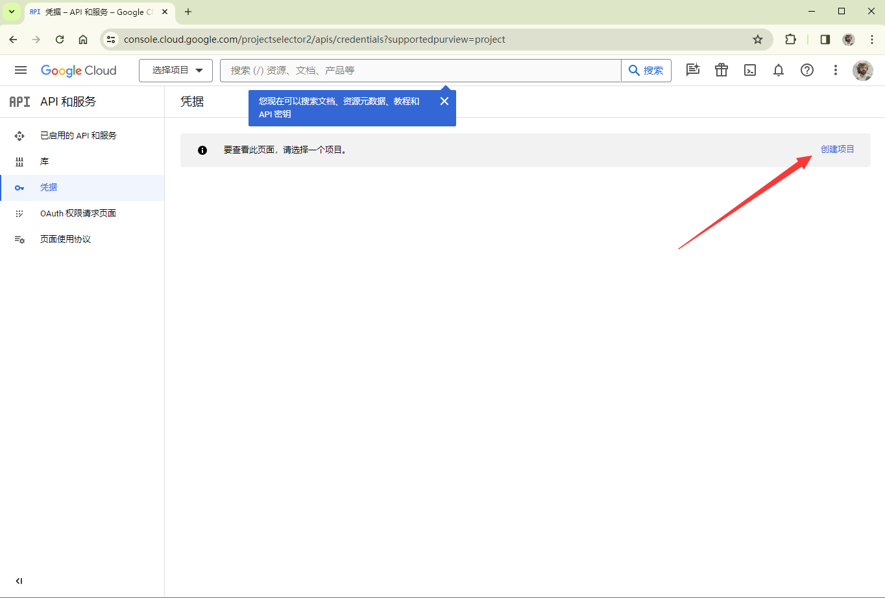

设置项目名称后点击创建即可

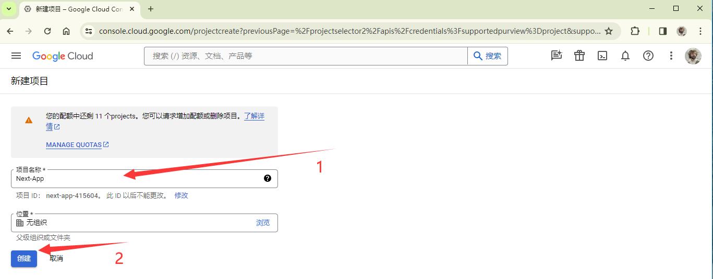

如下图，点击配置 Consent Screen

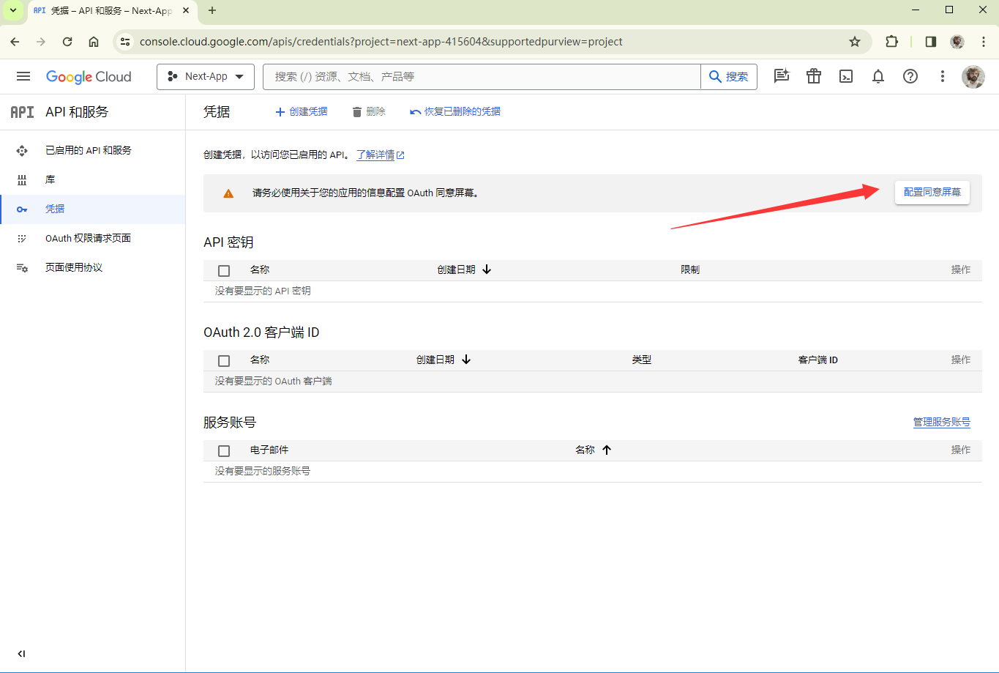

首先设置为供外部使用

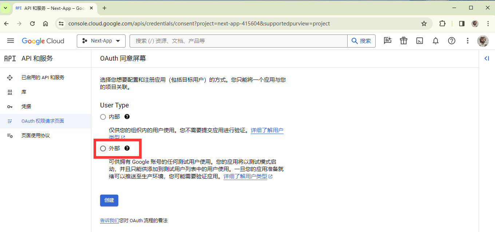

在弹出页面填写三个必须字段 `应用名称`，`用户支持电子邮件`，以及最下面的`开发者联系信息`，其他字段都可选填，比如图片 logo 之类的

点击页面最下面的保存并继续，设置应用权限，一般只添加 email 和 profile 即可。再点击保存并继续，添加测试用户，把自己的账户添加即可。

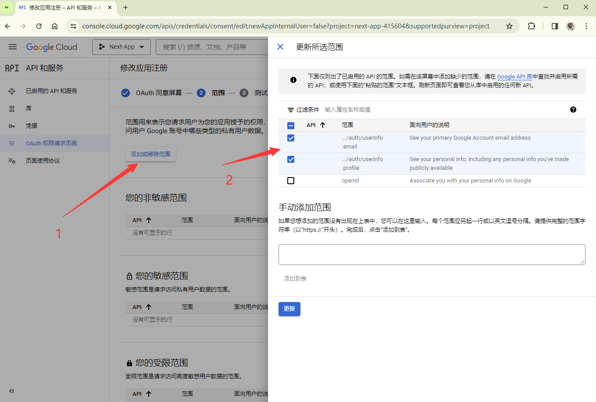

最后保存返回信息中心即可

### 创建 OAuth

在 `凭据` 页面点击创建 OAuth 客户端 ID

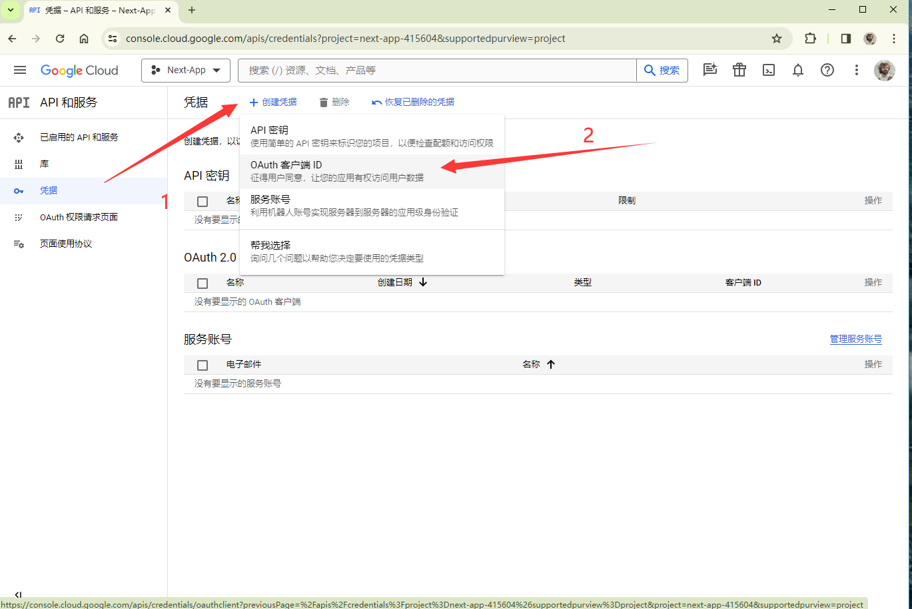

设置 OAuth，首先设置为 Web 应用，设置应用名，下方 JavaScript 来源设置为部署的端口(开发环境)，再下方设置重定向的 URI，在[Next Auth Google]页面有写

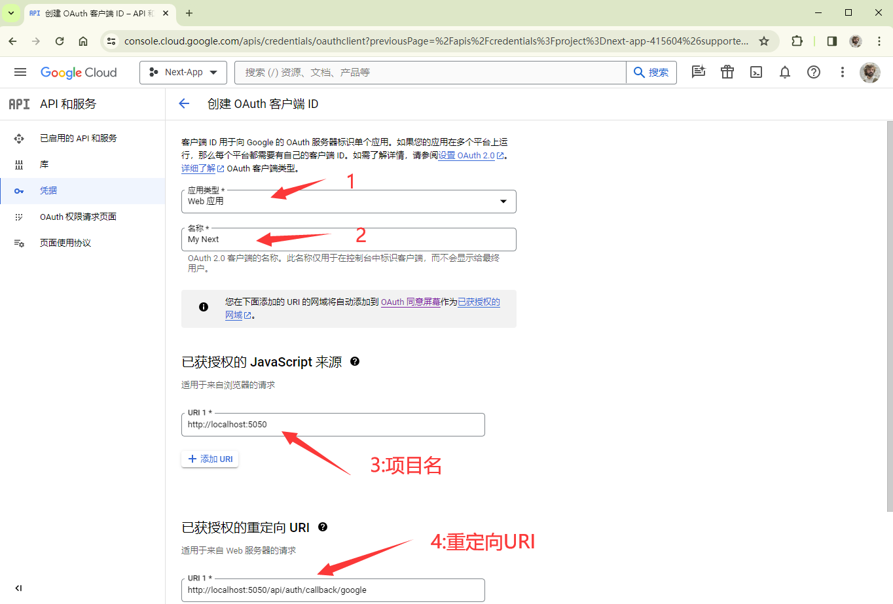

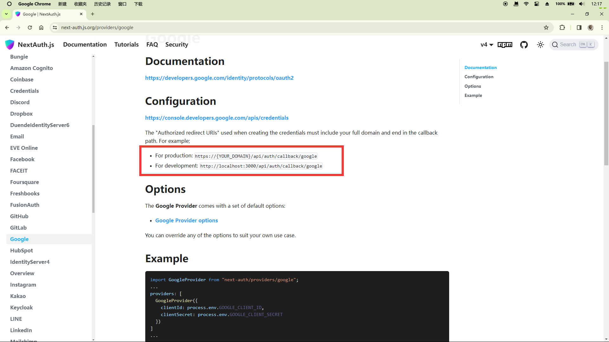

点击创建即可

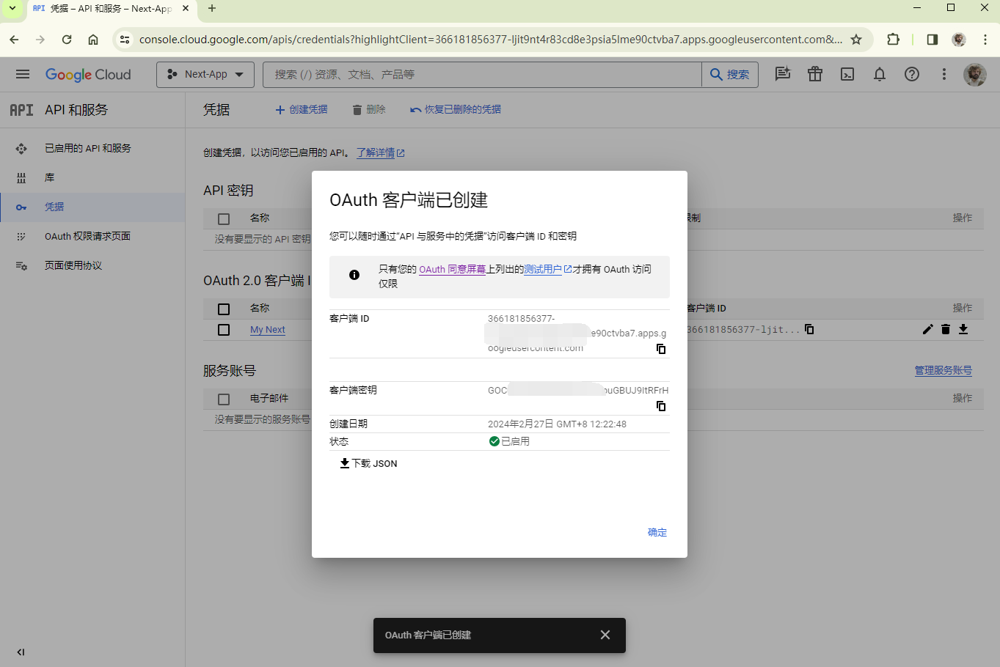

复制好客户端 id 和密钥备用

### 调用

回到 `.env` 中添加 `GOOGLE_CLIENT_ID` 和 `GOOGLE_CLIENT_SECRET`

```python title=".env"
DATABASE_URL="mysql://root:@localhost:3306/nextapp"
NEXT_PUBLIC_CLOUDINARY_CLOUD_NAME="dzwywfjst"
# 添加下面两行
NEXTAUTH_URL=http:localhost:5050 # 你的项目位置
NEXTAUTH_SECRETT=5xNi+cY1LdL1YnBWD9cUi4A34tTZJfUjKTlMCMjFcL0= # 随机数，可以使用 openssl random -base64 32 生成
# 刚刚的客户端id 和 密钥
# highlight-next-line
GOOGLE_CLIENT_ID=479267153395-gpqe25rbf62p0aj4h7icnfd01qt0p3qo.apps.googleusercontent.com
# highlight-next-line
GOOGLE_CLIENT_SECRET=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
```

在 auth/[...nextauth]/route.ts，并添加以下内容(直接复制即可)

```tsx title="api\auth[...nextauth]\route.ts"
import NextAuth from "next-auth";
import GoogleProvider from "next-auth/providers/google";

const handler = NextAuth({
  providers: [
    GoogleProvider({
      clientId: process.env.GOOGLE_CLIENT_ID!,
      clientSecret: process.env.GOOGLE_CLIENT_SECRET!,
    }),
  ],
});

export { handler as GET, handler as POST };
```

在 Navbar.tsx 中添加一个 Link 到 login

```tsx title="NavBar.tsx" showLineNumbers
import Link from "next/link";
import React from "react";

const NavBar = () => {
  return (
    <div className="flex bg-slate-200 p-5 space-x-3">
      <Link href="/" className="mr-5">
        Next.js
      </Link>
      <Link href="/users">Users</Link>
      {/* Add this Link */}
      {/* highlight-next-line*/}
      <Link href="/api/auth/signin">Login</Link>
    </div>
  );
};

export default NavBar;
```

回到浏览器，点击 login，即可看到如下页面

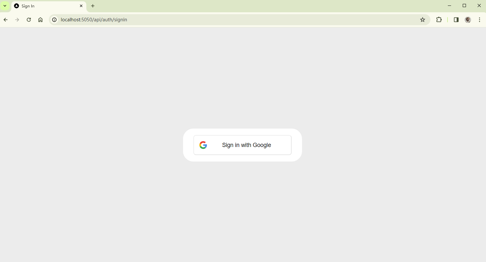

:::danger
由于某些魔法原因，next-auth 使用 google 一直在报 ERROR，笔者寻找多方也未解决，尝试使用 Github Provider 可行，故向读者推荐使用 Github Provider，并在下面给出演示

```plain
[next-auth][error][SIGNIN_OAUTH_ERROR]
https://next-auth.js.org/errors#signin_oauth_error outgoing request timed out after 3500ms {
  error: {
    message: 'outgoing request timed out after 3500ms',
    stack: 'RPError: outgoing request timed out after 3500ms\n' +
      .......
  name: 'RPError'
  },
  providerId: 'google',
  message: 'outgoing request timed out after 3500ms'
}
```

:::

### Github Provider

进入[Github OAuth App]页面，新建 OAuth App

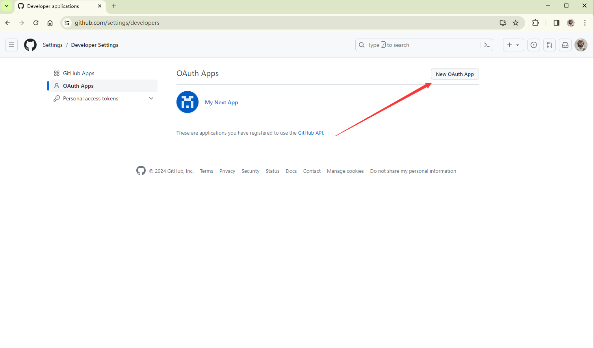

设置内容和 Google 内容差不多，Callback url 最后换成 Github 即可 `http://localhost:5050/api/auth/callback/github`

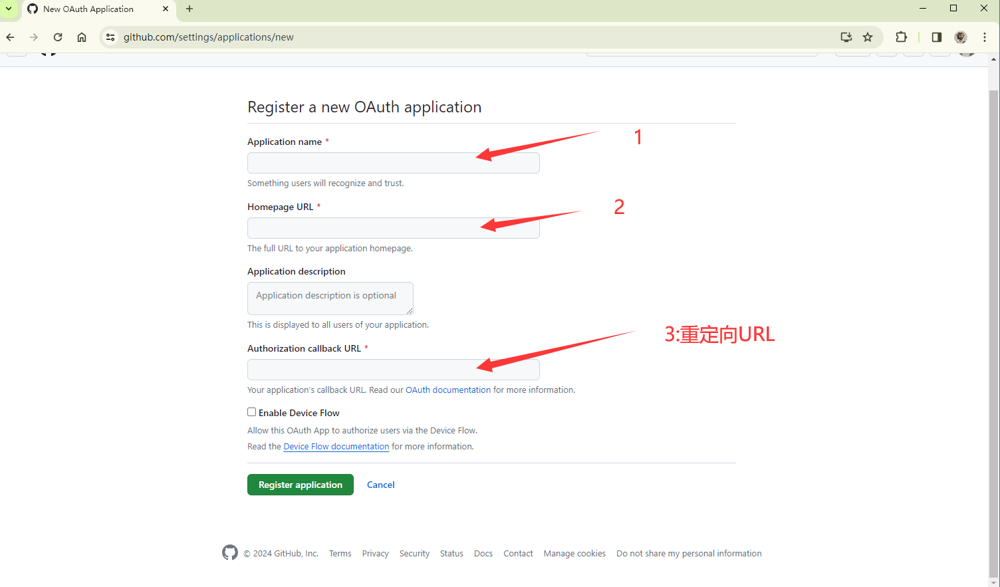

点击创建凭证

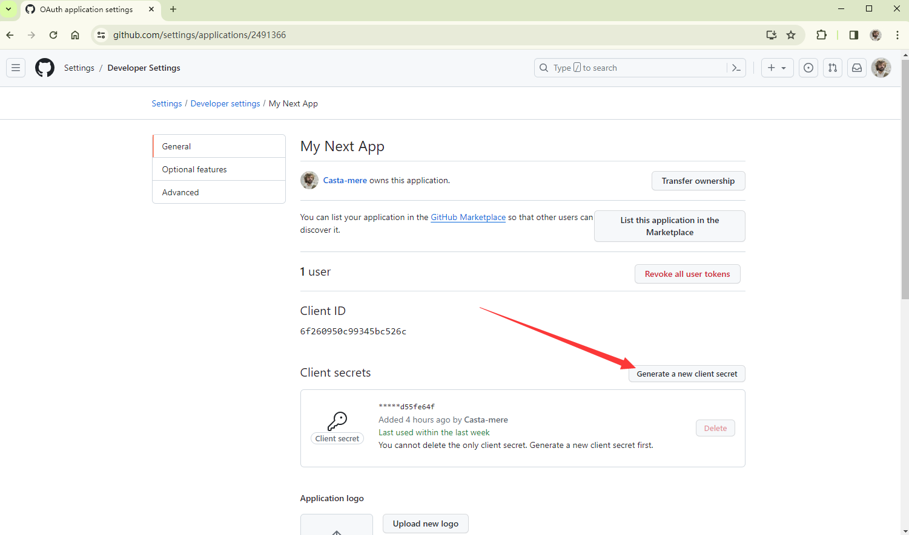

:::info IMPORTANT
注意，创建好后仅能在该页面复制一次，以后再也无法复制

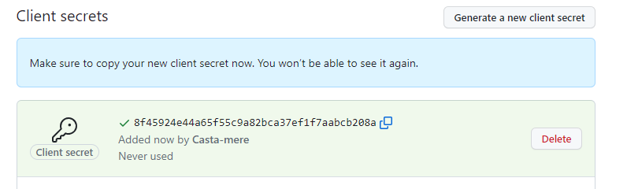
:::

回到 .env 中添加 GITHUB_CLIENT_ID 和 GITHUB_CLIENT_SECRET

```python title=".env"
DATABASE_URL="mysql://root:@localhost:3306/nextapp"
NEXT_PUBLIC_CLOUDINARY_CLOUD_NAME="dzwywfjst"
# 添加下面两行
NEXTAUTH_URL=http:localhost:5050 # 你的项目位置
NEXTAUTH_SECRETT=5xNi+cY1LdL1YnBWD9cUi4A34tTZJfUjKTlMCMjFcL0= # 随机数，可以使用 openssl random -base64 32 生成
# 刚刚的客户端id 和 密钥
# highlight-next-line
GITHUB_CLIENT_ID=6f1433456dsfa526c
# highlight-next-line
GITHUB_CLIENT_SECRET=ec8055183a9adfefsf0b305c282be6d55fe64f
```

修改 auth/[...nextauth]/route.ts 中的 provider 为 Github

```tsx title="api\auth[...nextauth]\route.ts"
import NextAuth from "next-auth";
import Github from "next-auth/providers/github";

const handler = NextAuth({
  providers: [
    Github({
      clientId: process.env.GITHUB_CLIENT_ID!,
      clientSecret: process.env.GITHUB_CLIENT_SECRET!,
    }),
  ],
});

export { handler as GET, handler as POST };
```

保存，进入 Login 界面即可正常使用 Github 登录

## Session

### Check Session

在浏览器中打开开发者工具，进入工具，选择 cookie，即可看到这里有一条 `next-auth.session-token` ，其本质为一个 json web token，为了查看这个 cookie，我们可以在 /api/auth 下新建 token/route.ts，并添加以下内容

```ts title="/api/auth/token/route.ts" showLineNumbers
import { getToken } from "next-auth/jwt";
import { NextRequest, NextResponse } from "next/server";

export async function GET(request: NextRequest) {
  const token = await getToken({ req: request });
  return NextResponse.json(token);
}
```

去浏览器访问 http://localhost:5050/api/auth/token 即可看到如下内容

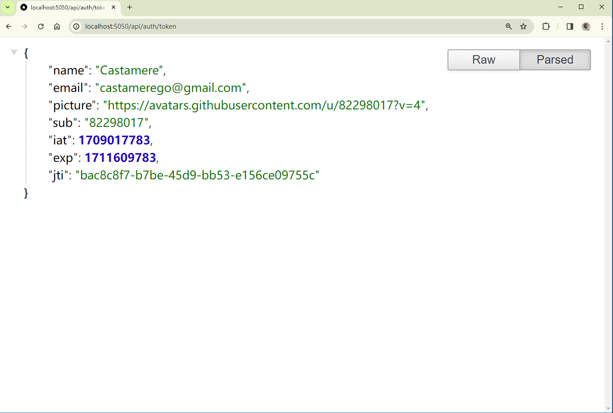

其包含如用户名，邮箱，头像，过期时间等信息

### Accessing Session from client

在用户端获取 session 信息需要用到 SessionProvider。我们首先创建一个新 component `/auth/AuthProvider.tsx`。将所有 children 用 SessionProvider 包起来

```tsx title="/auth/AuthProvider.tsx" showLineNumbers
"use client";
import React, { ReactNode } from "react";
import { SessionProvider } from "next-auth/react";

const AuthProvider = ({ children }: { children: ReactNode }) => {
  return (
    <>
      <SessionProvider>{children}</SessionProvider>
    </>
  );
};
export default AuthProvider;
```

然后回到根文件夹的 `layout.tsx` 中

```tsx title="layout.tsx" showLineNumbers
  import "./globals.css";
  import type { Metadata } from "next";
  import { Inter } from "next/font/google";
  import NavBar from "./NavBar";
// 导入刚刚的 AuthProvider
// git-add-next-line
+ import AuthProvider from "./auth/Provider";

  const inter = Inter({ subsets: ["latin"] });

  export const metadata: Metadata = {
    title: "Create Next App",
    description: "Generated by create next app",
  };

  export default function RootLayout({
    children,
  }: {
    children: React.ReactNode;
  }) {
    return (
      <html lang="en" data-theme="winter">
        <body className={inter.className}>
{/*将 body 里的内容都用 AuthProvider 包起来*/}
{/* git-add-next-line */}
+         <AuthProvider>
            <NavBar />
            <main className="p-5">{children}</main>
{/* git-add-next-line */}
+         </AuthProvider>
        </body>
      </html>
    );
  }
```

之后到 NavBar 组件里获取 Session 内容

```tsx title="NavBar.tsx" showLineNumbers
  "use client";
// improt useSession
// git-add-next-line
+ import { useSession } from "next-auth/react";
  import Link from "next/link";
  import React from "react";

  const NavBar = () => {
// 使用 useSession() 来获取 Session 中的数据
// git-add-next-line
+   const { status, data: session } = useSession();

    return (
      <div className="flex bg-slate-200 p-5 space-x-3">
        <Link href="/" className="mr-5">
          Next.js
        </Link>
        <Link href="/users">Users</Link>
{/*根据status的不同状态来渲染 "登录" 或者 "用户" 或 "加载中"*/}
{/*git-add-start*/}
+       {status === "loading" && <div>Loading...</div>}
+       {status === "authenticated" && <div>{session.user!.name}</div>}
+       {status === "unauthenticated" && (
+         <Link href="/api/auth/signin">Login</Link>
+       )}
{/*git-add-end*/}
      </div>
    );
  };

  export default NavBar;
```

此时回到浏览器，刷新即可看到，可以正常显示用户名了

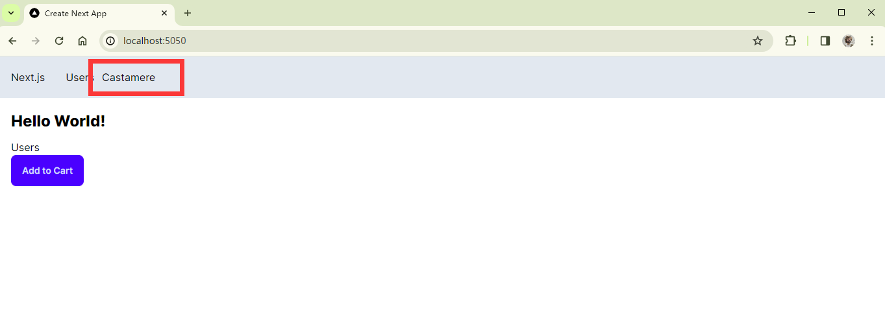

[Next-Auth]: https://next-auth.js.org/
[Next Auth Provider]: https://next-auth.js.org/providers/
[Google]: https://next-auth.js.org/providers/google
[Github]: https://next-auth.js.org/providers/github
[Google Credentials]: https://console.developers.google.com/apis/credentials
[Facebook]: https://next-auth.js.org/providers/facebook
[Next Auth Google]: https://next-auth.js.org/providers/google
[Github OAuth App]: https://github.com/settings/developers
