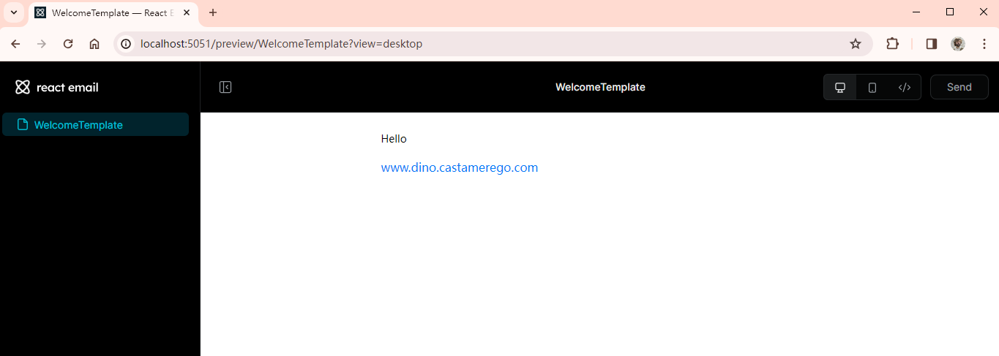

---
last_update:
  date: 28 Feb 2024 GMT
  author: Casta-mere
---

# 发送邮件

## Setting Up React Email

[React Email] 是一个高效便捷的 Email 库，包含多个组件，包括编写，发送等等功能。使用 `npm i react-email @react-email/components` 安装

安装好打开 package.json，在 scripts 中添加 `"preview-email": "email dev -p 5051"` script

```json
"scripts": {
  "dev": "next dev -- -p 5050",
  "build": "next build",
  "start": "next start -- -p 5050",
  "lint": "next lint",
  // Add this
  // highlight-next-line
  "preview-email": "email dev -p 5051"
},
```

## Careate Email Temple

在根目录下(app 同级目录)创建 emails 文件夹，在其中创建 WelcomeTemplate.tsx。如下就是一个邮件的模板，会将输入用户的名字添加到其中

```tsx title="emails/WelcomeTemplate.tsx" showLineNumbers
import React from "react";
import {
  Html,
  Body,
  Container,
  Text,
  Link,
  Preview,
} from "@react-email/components";

const WelcomeTemplate = ({ name }: { name: string }) => {
  return (
    <Html>
      <Preview>Welcome aborad!</Preview>
      <Body>
        <Container>
          <Text>Hello {name}</Text>
          <Link href="http://dino.castamerego.com">
            www.dino.castamerego.com
          </Link>
        </Container>
      </Body>
    </Html>
  );
};
export default WelcomeTemplate;
```

## Preview Email

首先在 .gitignore 中添加 `.react-email`，以防产生的大量文件污染 git。使用 `npm preview-email` 命令， 打开浏览器，访问对应端口(笔者设置的是 localhost:5051)即可看到



## Style Email

我们可以直接使用 CSS 来添加样式，也可以直接使用 Tailwind，这里把两种都给出

import Tabs from "@theme/Tabs";
import TabItem from "@theme/TabItem";

<Tabs className="unique-tabs">
  <TabItem value="CSS" label="CSS" default>

    ```tsx title="emails/WelcomTemplate.tsx" showLineNumbers
    // Use CSS
    import React, { CSSProperties } from "react";
    import {
      Html,
      Body,
      Container,
      Text,
      Link,
      Preview,
    } from "@react-email/components";

    const WelcomeTemplate = ({ name }: { name: string }) => {
      return (
        <Html>
          <Preview>Welcome aborad!</Preview>
          <Body style={body}>
            <Container>
              <Text style={heading}>Hello {name}</Text>
              <Link href="http://dino.castamerego.com">
                www.dino.castamerego.com
              </Link>
            </Container>
          </Body>
        </Html>
      );
    };

    const body: CSSProperties = {
      background: "#fff",
    };

    const heading: CSSProperties = {
      fontSize: "32px",
    };

    export default WelcomeTemplate;
    ```

  </TabItem>
  <TabItem value="TailWind" label="TailWind">
  
    ```tsx title="emails/WelcomTemplate.tsx" showLineNumbers
    // Use TailWind
    import React, { CSSProperties } from "react";
    import {
      Html,
      Body,
      Container,
    // import Tailwind
    // highlight-next-line
      Tailwind,
      Text,
      Link,
      Preview,
    } from "@react-email/components";

    const WelcomeTemplate = ({ name }: { name: string }) => {
      return (
        <Html>
          <Preview>Welcome aborad!</Preview>
          {/* 将 Body 用 <Tailwind> 包起来*/}
          {/* highlight-next-line */}
          <Tailwind>
            <Body className="bg-white">
              <Container>
                <Text className="font-bold text-3xl">Hello {name}</Text>
                <Link href="http://dino.castamerego.com">
                  www.dino.castamerego.com
                </Link>
              </Container>
            </Body>
          </Tailwind>
        </Html>
      );
    };

    export default WelcomeTemplate;
    ```

  </TabItem>
</Tabs>

## Sending Emails

使用 `npm i resend@1.0.0` 安装 resend 用于发送邮件。进入[Resend]官网，注册账号，获取一个 API Key，并添加到 `.env` 中，设置 `RESEND_API_KEY=...` 即可。在 `api/` 中添加 `send-email/route.tsx`，调用 resend.emails.send() 即可

```tsx title="api/send-email/route.tsx" showLineNumbers
import WelcomeTemplate from "@/emails/WelcomeTemplate";
import { NextResponse } from "next/server";
import { Resend } from "resend";

const resend = new Resend(process.env.RESEND_API_KEY!);

export async function POST() {
  await resend.emails.send({
    from: "...",
    to: "castamere@gmail.com",
    subject: "...",
    react: <WelcomeTemplate name="Castamere" />,
  });

  return NextResponse.json({});
}
```

[React Email]: https://react.email/docs/introduction
[Resend]: https://resend.com/
