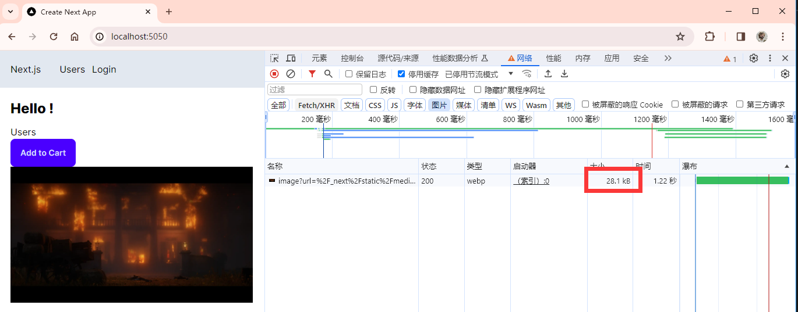

# 优化技巧

本篇包括以下内容:

- Optimizing images
- Using third-party JS libraries
- Using custom fonts
- Search engine optimizaion
- Lazy loading

## 优化 image

[本章代码链接](https://github.com/Casta-mere/Dash-Board/tree/2bf9d559f1f003f17bf33cd473eb4a97d5723f22)

在 Next.js 中需要加载静态图片时，可以使用 `next/image` 中的 Image 组件。其导入的图片也是以对象的形式 import 进来。同样也可以使用 url 的形式获取网络资源。在 [Nextjs Image] 页面可以看到它的更多用法

```tsx
import Image from "next/image";
import RDR2 from "@/public/RDR2.png";

export default async function Home() {
  const session = await getServerSession(authOptions);
  return (
    <>
      ...
      <Image src={RDR2} alt="An image of RDR2" />
      <Image src="https://bit.ly/react-cover" alt="React cover" />
      ...
    </>
  );
}
```

如果想要使用 url 的形式获取网络资源，出于安全原因，需要先在 `next.config.js` 中添加对应的域名才可以正常获取。添加好后需要重新运行项目就可以正常获取网络资源了

```js title="next.config.js" showLineNumbers
/** @type {import('next').NextConfig} */
const nextConfig = {
  images: {
    remotePatterns: [
      {
        protocol: "https",
        hostname: "bit.ly",
      },
    ],
  },
};

module.exports = nextConfig;
```

使用 `<Image>` 标签的好处是，可以将图片转为 webp 格式，极大的减少 Size，比如这张图原图大小为 2.08MB，可以看到实际上网页里的只有 28.1KB



## 使用第三方脚本

在使用第三方 js 脚本的时候，我们可以将其封装为一个 component，然后在对应的 layout.tsx 中直接使用即可。注意应使用 Next 的 `<Script>` 标签。若有识别不出 js 语法的问题，可以用 \{\`\`\} 将 js 代码包裹起来

## 字体

[本章代码链接](https://github.com/Casta-mere/Dash-Board/tree/db6486445cba2df54ae32c3261216289f27d3943)

### 网络字体

想要使用其他的官方字体，我们只需要在 layout.tsx 中从 "next/font" 中导入，并在对应标签的 className 中设置即可。比如下面就是使用 Roboto 字体的演示。在[Google Fonts]这里可以找到各种 Google 字体。在使用这种官方字体库时，仅在第一次使用时会去下载这个字体文件，后面会一直使用下载好的文件，不必担心由于网络问题导致字体出错

```tsx title="layout.tsx" showLineNumbers
import "./globals.css";
import type { Metadata } from "next";
// import 字体
// highlight-next-line
import { Inter, Roboto } from "next/font/google";
import NavBar from "./NavBar";
import AuthProvider from "./auth/Provider";

const inter = Inter({ subsets: ["latin"] });
// 调用字体
// highlight-next-line
const roboto = Roboto({ subsets: ["latin"], weight: ["400", "500"] });

export const metadata: Metadata = {
  title: "Create Next App",
  description: "Generated by create next app",
};

export default function RootLayout({
  children,
}: {
  children: React.ReactNode;
}) {
  return (
    <html lang="en" data-theme="winter">
      {/* 设置字体 */}
      {/* highlight-next-line */}
      <body className={roboto.className}>
        <AuthProvider>
          <NavBar />
          <main className="p-5">{children}</main>
        </AuthProvider>
      </body>
    </html>
  );
}
```

### 本地字体

同样的，我们也可以使用本地字体。这里以 poppings 字体为例。首先将下载好的文件放到 "public/fonts" 中。然后和官方字体一样，在 layout.tsx 中调用

```tsx title="layout.tsx" showLineNumbers
import "./globals.css";
import type { Metadata } from "next";
import { Inter, Roboto } from "next/font/google";
// import 字体
// highlight-next-line
import localFont from "next/font/local";
import NavBar from "./NavBar";
import AuthProvider from "./auth/Provider";

const inter = Inter({ subsets: ["latin"] });
const roboto = Roboto({ subsets: ["latin"], weight: ["400", "500"] });
// 设置source和变量名(用于TailWind)
// highlight-start
const poppins = localFont({
  src: "../public/fonts/Poppins-Regular.ttf",
  variable: "--font-poppings",
});
// highlight-end

export const metadata: Metadata = {
  title: "Create Next App",
  description: "Generated by create next app",
};

export default function RootLayout({
  children,
}: {
  children: React.ReactNode;
}) {
  return (
    <html lang="en" data-theme="winter">
      {/* 设置字体，注意使用 .variable 而不是 .className */}
      {/* highlight-next-line */}
      <body className={poppins.variable}>
        <AuthProvider>
          <NavBar />
          <main className="p-5">{children}</main>
        </AuthProvider>
      </body>
    </html>
  );
}
```

除此之外，我们可以将自定义字体注册到 TailWind 中:

```ts title="tailwind.config.ts" showLineNumbers
  import type { Config } from "tailwindcss";

  const config: Config = {
    content: [
      "./pages/**/*.{js,ts,jsx,tsx,mdx}",
      "./components/**/*.{js,ts,jsx,tsx,mdx}",
      "./app/**/*.{js,ts,jsx,tsx,mdx}",
    ],
    theme: {
      extend: {
        backgroundImage: {
          "gradient-radial": "radial-gradient(var(--tw-gradient-stops))",
          "gradient-conic":
            "conic-gradient(from 180deg at 50% 50%, var(--tw-gradient-stops))",
        },
        // 注册字体，其 var 就是刚刚设置的 variable
        // git-add-start
+       fontFamily: {
+         poppins: "var(--font-poppings)",
+       },
        // git-add-end
      },
    },
    plugins: [require("daisyui")],
    daisyui: ["winter"],
  };
  export default config;
```

注册好之后，就可以像下面这样使用

```tsx
<h1 className="font-poppins">Hello World!</h1>
```

同样也可以直接应用到 global.css 中 来覆盖所有的 h1 标签

```css
@layer base {
  h1 {
    @apply font-extrabold text-2xl mb-3 font-poppins;
  }
}
```

## 搜索引擎优化

[本章代码链接](https://github.com/Casta-mere/Dash-Board/tree/4978717de685aa8ed039edde4e4f29499ed8aba7)

我们可以在每个 pag.tsx 中添加以下内容，包括每页的题目和描述等内容

```tsx
import { Metadata } from "next";

export const metadata: Metadata = {
  title: "...",
  description: "...",
};
```

我们也可以根据某些数据来自动生成 metadata，比如从 API 或者数据库中获取数据

```tsx
import { Metadata } from "next";

export async function generateMetada(): Promise<Metadata> {
  const metaData = await fetch("");
  return {
    title: "metaData.title",
    description: "...",
  };+
}
```

## Lazy Loading

[本章代码链接](https://github.com/Casta-mere/Dash-Board/tree/cd71ae297037012268e00db3222c0ff7e37be112)

在某些页面可能存在过多的组件，而且这些组件并不是一进到页面就会显示的，比如点击某个 button 才会显示，此时如果组件的数据量过于庞大(比如一个富文本编辑器)，就会导致加载十分缓慢，此时就可以用到 Lazy Loading。在下面的演示中，我们的 HeavyComponent 不用一开始就 import 进来，而是使用 dynamic 函数进行导入，会自动在需要的时候导入，我们还可以设置 loading 函数，让其在加载时有占位符

```tsx
// git-remove-next-line
- import HeavyComponent from "./components/HeavyComponent";
// git-add-start
+ import dynamic from "next/dynamic";
+ const HeavyComponent = dynamic(() => import("./components/HeavyComponent"), {
+   ssr: false,
+   loading: () => <p>Loading...</p>,
+ });
// git-add-end
  export default async function Home() {
    const [show, setShow] = useState(false);
    return (
      ...
        <button onClick={() => setShow(true)}>Show</button>
        Show && <HeavyComponent />
      ...
    );
  }
```

同样的，比如我们需要用到某个函数，我们也可以使用 import 函数来进行 Lazy Loading

```tsx
<button onClick={()=>{
  _ = import("./components/sort");
  const item = []
  _.sort(item,asec);
}}>Sort<>
```

[Nextjs Image]: https://nextjs.org/docs/app/api-reference/components/image
[Google Fonts]: https://fonts.google.com/
