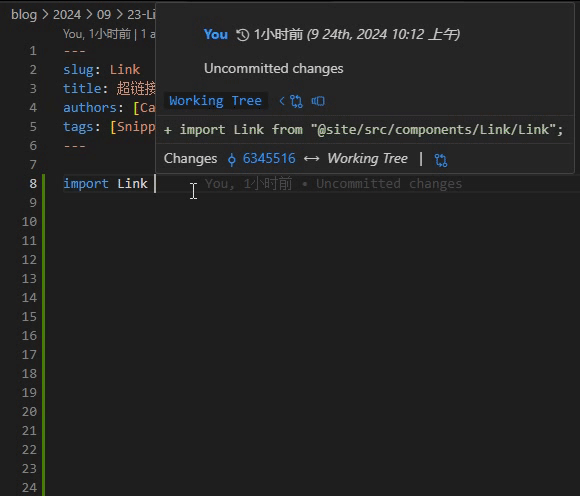

# Docusaurus FAQ

99% 的 Docusaurus 问题都可以通过官方文档解决，但无奈官方文档实在是太多了，这里记录一些笔者路上遇到的问题

还是那句话

> 程序员 101：Read The Fucking Manual

## Typscript Type 问题

[Docusaurus Typescript] 一章讲到

> It is added just for a nicer Editor experience

在使用 Docusaurus 过程中，想要 import docusaurus 的组件，即使用 `import { xxx } from '@docusaurus/...'` 的时候，编辑器会提示找不到模块，但运行却没什么问题

其实就运行来说，没什么大问题，但在编写代码的时候，冒一堆红总是让人看着难受。而且也没法使用 VsCode 的一些快捷操作，很糟心。解决方式如下：

首先安装对应的 Types

```bash
npm install --save-dev typescript @docusaurus/module-type-aliases @docusaurus/tsconfig @docusaurus/types
```

然后在项目根目录下添加 `tsconfig.json` 文件，内容如下：

```json
{
  "extends": "@docusaurus/tsconfig",
  "compilerOptions": {
    "baseUrl": "."
  }
}
```

:::tip
弄好如果还报错，就 reload window 一下，应该就好了
:::

## @site 问题

在 [Docusaurus Import] 一章中讲到，`@site` 别名指向网站根目录，我们可以使用

```tsx
import BrowserWindow from "@site/src/components/BrowserWindow";
```

的方式来引入组件。和上一个问题相同，这个在运行时也没什么问题。但还是会有编辑器报错和没法用快捷操作的问题，解决方式如下：

修改 `tsconfig.json` 文件，如下即可解决上述两个问题：

```json
{
  "extends": "@docusaurus/tsconfig",
  "compilerOptions": {
    "baseUrl": "./",
    "paths": {
      "@site/*": ["*"]
    },
    "jsx": "react",
    "esModuleInterop": true,
    "allowSyntheticDefaultImports": true
  }
}
```

使用效果如下：



## 亮/暗模式钩子

在 [Docusaurus useColorMode] 中，介绍了一个 `useColorMode` 钩子，可以用来获取当前主题模式

```tsx
import React from "react";
// highlight-next-line
import { useColorMode } from "@docusaurus/theme-common";

const Example = () => {
  // highlight-next-line
  const { colorMode, setColorMode } = useColorMode();

  return <h1>Dark mode is now {colorMode === "dark" ? "on" : "off"}</h1>;
};
```

[Docusaurus Typescript]: https://docusaurus.io/zh-CN/docs/typescript-support
[Docusaurus Import]: https://docusaurus.io/zh-CN/docs/next/markdown-features/react#importing-components
[Docusaurus useColorMode]: https://docusaurus.io/zh-CN/docs/api/themes/configuration#use-color-mode
