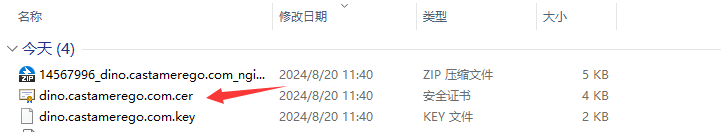

# SSL 证书配置

**为网站配置 https**

## 购买证书

登录阿里云后，搜索 `SSL` ，选择 `个人测试证书`，然后按下图所示操作，为自己的域名进行申请


:::important
证书申请一般一两个小时就会通过，如果长时间没有通过，检查一下是否有域名解析要求
:::

通过之后，根据自己的服务器类型，下载对应格式的证书。笔者使用 `nginx` 格式的服务器，如果想跟着笔者一起使用 `nginx`，可以参考上一篇[Nginx 反代理]，这里就不再赘述


下载好，解压出来应该是两个文件 `xx.xx.xx.pem` 和 `xx.xx.xx.key` 。首先确认这个 `xx.xx.xx` 和自己要部署的域名完全一致，然后我们需要将 `.pem` 文件重命名后缀为 `.cer`



## Nginx 配置

接下来连上我们的服务器，首先使用 `nginx -t` 查看配置文件在哪里


这里可以看到，在 `/etc/nginx/` 文件夹内，切换到该文件夹下，可以看到有 `conf.d` 文件夹和刚刚看到的 `nginx.conf` 文件，注意我们要修改的是 `conf.d` 文件夹中的内容


进入到 `conf.d` 文件夹，新建一个文件夹 `cert` 将之前的两个证书文件 `.cer` 和 `.key` 使用 scp 等方式放到这个文件夹下


放好之后开始修改 `server.conf`，注意这个文件是笔者上一篇中自己创建的文件，如果是新做的项目，新建一个 `xx.conf` 文件即可。修改至如下格式，要同时有 `http` 和 `https` 的配置，并在 `http` 中添加重定向，将所有 `http` 请求重定向到 `https`。`htpps` 中的部分，只需要修改域名，证书文件路径，端口号即可(要修改的内容已全部高亮)

```bash showLineNumbers title="server.conf"
server {
  listen 80;
  # highlight-next-line
  server_name App1.domain.com;  # 这里换成你解析的域名

  # 添加下面这行，将所有的http请求重定向到https
  # highlight-next-line
  rewrite ^(.*)$ https://$host$1;

  location / {
  # highlight-next-line
    proxy_pass http://localhost:xxxx; # 这里换成你该域名对应项目所在的端口号
  }
}

server {
  listen 443 ssl;
  server_name App1.domain.com;  # 这里换成你解析的域名

  # 证书文件路径
  # highlight-next-line
  ssl_certificate       conf.d/cert/xx.xx.xx.cer;
  # highlight-next-line
  ssl_certificate_key   conf.d/cert/xx.xx.xx.key;

  ssl_session_cache     shared:SSL:1m;
  ssl_session_timeout   5m;

  ssl_ciphers           HIGH:!aNULL:!MD5;
  ssl_prefer_server_ciphers on;

  location / {
  # highlight-next-line
    proxy_pass http://localhost:xxxx; # 这里换成你该域名对应项目所在的端口号
  }
}
```

## 验证结果

修改完成后，使用 `nginx -s reload` 来应用配置，回到网页里刷新，看到出现 🔒 图标，就表明配置成功，快乐使用 https 了


可以点击 🔒 图标，查看证书具体内容


## 后记

阿里云的免费 SSL 每次只能维持三个月，应该是要每三个月重新申请，只需要每次去服务器换一下文件即可。对于个人项目来说，完全够用

[Nginx 反代理]: ./NginxReverseProxy
