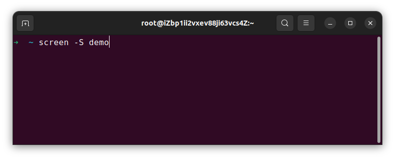
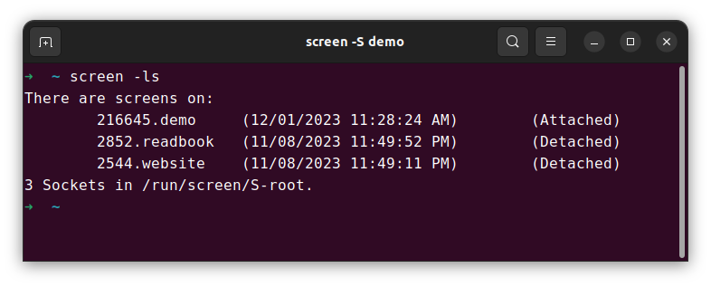
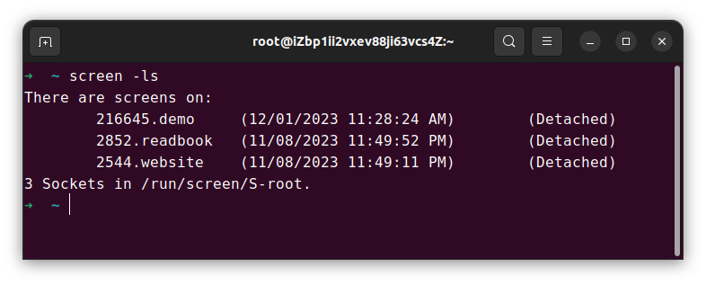

# Screen

**让你的项目在后台运行**

平时在使用 ssh 连接到服务器后，总是有个问题，关闭 ssh 后，在这个窗口里跑的进程就会被 kill，本文就此给出解决办法

## Screen

:::info

GNU Screen 是一个用于在 Unix-like 系统中创建多个虚拟终端会话的终端复用程序。它允许用户**同时运行多个独立的命令行界面**，在不同的 shell 窗口之间切换，以及在**后台运行长时间运行的进程**。

使用 GNU Screen，您可以打开一个或多个终端窗口，并在每个窗口中运行不同的程序或命令。您可以使用快捷键在窗口之间切换，还可以通过分割窗口创建多个终端区域来同时查看不同的命令输出。如果您需要离开当前终端会话，您可以将它置于后台运行，并在稍后恢复。

GNU Screen 还具有其他许多功能，例如支持多用户会话、会话共享和会话记录。它还可以使用配置文件进行高度自定义，以满足个人偏好和需求。

:::

更多细节可以访问官网[GNU Screen]查看

## 安装 Screen

```bash
apt install screen
```

## 简单 demo

安装好后，使用 `screen -S 窗口名` 来新建一个 screen，比如这里创建了一个新的 `demo` screen



创建好后，当前的终端会自动 attach 到这个 screen 上。使用 `screen -ls` 可以查看当前所有的 screen



在当前的 screen 里，运行好项目，使用快捷键 `ctrl`+`a`+`d`，来退出当前 screen

退出后再次使用 `screen -ls` ，可以看到, `demo` screen 的状态变成了 `Detached`



可以看到每个 screen 都有一个独立的 id，在需要回到某个 screen 的时候需要用到，使用 `screen -r 窗口号`，比如我这里的 `demo` screen 的 id 是 216645，就可以通过 `screen -r 216645` 重新连接到这个 screen

如果需要删除某个 screen ，可以 attach 这个 screen 后，使用 `exit` 指令来退出并删除

## 常用 Screen 指令

```bash showLineNumbers
screen -S 窗口名 #新建窗口
screen -ls # 列出当前窗口
screen -r 窗口号 # 回到指定窗口
exit # 删除当前窗口
Ctrl+a+d # 退出当前窗口
```

[GNU Screen]: https://www.gnu.org/software/screen/
