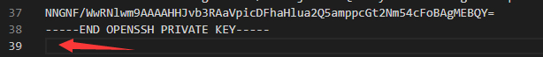
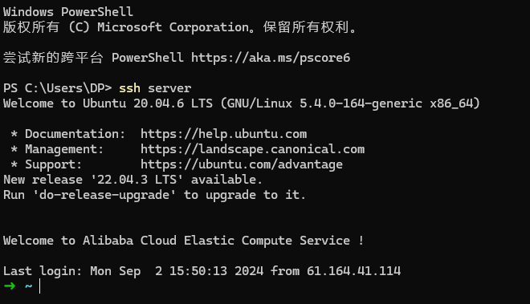

import Terminal_1 from "./components/Server/ssh_1";
import Terminal_2 from "./components/Server/ssh_2";

拿到一个新服务器，总有一些固定的配置内容。尤其是对于我们这种薅阿里云羊毛的来说，常换服务器，还是记录一下的好

:::important
笔者使用的是 Ubuntu 22.04.4 LTS，但大部分内容大同小异
:::

## 初始化配置

```bash
apt-get update
apt install less
apt install screen
apt install net-tools
```

## 配置 ssh

首先使用 `cd ~/.ssh` 进入到 ssh 的配置文件夹，当前目录下应该仅有一个 `authorized_keys` 空文件，使用 `ssh-keygen` 生成公钥和私钥

<Terminal_1 />

可以看到，当前有一个公钥(id_rsa.pub)和一个私钥(id_rsa)，接下来就是对他们两个进行操作，首先处理公钥：使用 `cat ./id_rsa.pub >> authorized_keys` 指令，将生成的公钥放入到 `authorized_keys` 文件中，然后修改 ssh 配置文件，使用 `vim /etc/ssh/sshd_config` 指令，将 `PubkeyAuthentication yes` 这行的注释去掉

<Terminal_2 />

接下来处理私钥的部分，首先本地打开 vscode ,使用 `ctrl` + `shift` + `p` 打开命令面板，输入 `ssh-config`，选择打开 ssh 配置文件


打开后可以看到这个目录，将刚刚生成的私钥文件复制到这个文件夹下


:::tip
可以选择直接把文件复制出来，如果不方便的话，可以在服务器上 cat 一下文件内容，然后再粘贴到本地。**注意，私钥的最后有一个空行，这个很容易出错**


:::

复制好后，添加如下配置

```bash showLineNumbers title=".ssh\config"
Host server                    # 自定义的名字
    HostName 120.55.91.206     # 你服务器的ip
    User root                  # 服务器的用户名
    IdentityFile ~\.ssh\id_rsa # 刚刚复制进去的私钥文件
```

保存后，打开一个终端，就可以直接使用 `ssh server(刚刚自定义的名字)` 来连接到你的服务器了。之后使用 `scp` 等命令时，也可以直接使用 `server:/root/...` 的形式



:::important
这部分配置完成后，建议读者上到服务器，把密码登录的选项给注释掉，公有云的服务器，如果没买安全防护类产品，每天能有一万个 ip 尝试登入...

还是在 /etc/ssh/sshd_config 里修改就 ok 了

```bash
PasswordAuthentication no
```

:::

## 配置 zsh

## 配置 npm

## 安装软件
