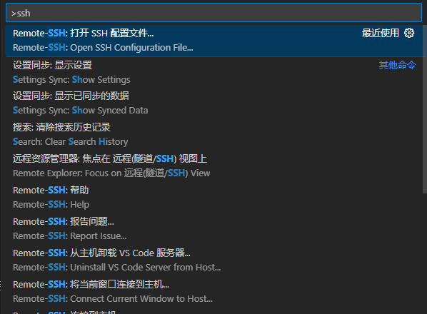
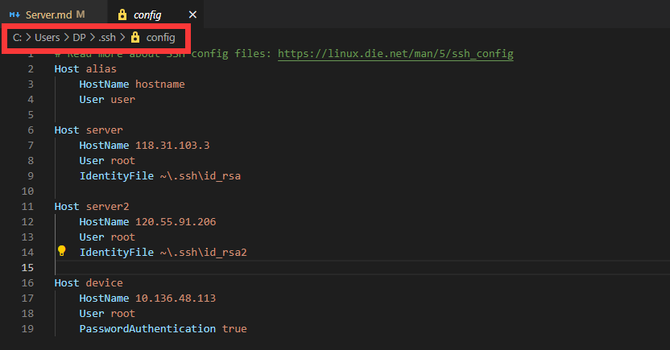
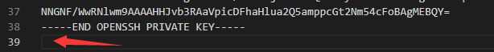
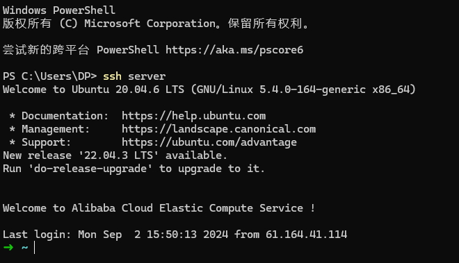

import Terminal_1 from "./components/Server/ssh_1";
import Terminal_2 from "./components/Server/ssh_2";

拿到一个新服务器，总有一些固定的配置内容。尤其是对于我们这种薅阿里云羊毛的来说，常换服务器，还是记录一下的好

:::important
笔者使用的是 Ubuntu 22.04.4 LTS，但大部分内容大同小异
:::

## 初始化配置

```bash
apt-get update
apt install less
apt install screen
apt install net-tools
```

## 配置 ssh

首先使用 `cd ~/.ssh` 进入到 ssh 的配置文件夹，当前目录下应该仅有一个 `authorized_keys` 空文件，使用 `ssh-keygen` 生成公钥和私钥

<Terminal_1 />

可以看到，当前有一个公钥(id_rsa.pub)和一个私钥(id_rsa)，接下来就是对他们两个进行操作，首先处理公钥：使用 `cat ./id_rsa.pub >> authorized_keys` 指令，将生成的公钥放入到 `authorized_keys` 文件中，然后修改 ssh 配置文件，使用 `vim /etc/ssh/sshd_config` 指令，将 `PubkeyAuthentication yes` 这行的注释去掉

<Terminal_2 />

接下来处理私钥的部分，首先本地打开 vscode ,使用 `ctrl` + `shift` + `p` 打开命令面板，输入 `ssh-config`，选择打开 ssh 配置文件



打开后可以看到这个目录，将刚刚生成的私钥文件复制到这个文件夹下



:::tip
可以选择直接把文件复制出来，如果不方便的话，可以在服务器上 cat 一下文件内容，然后再粘贴到本地。**注意，私钥的最后有一个空行，这个很容易出错**


:::

复制好后，添加如下配置

```bash showLineNumbers title=".ssh\config"
Host server                    # 自定义的名字
    HostName 120.55.91.206     # 你服务器的ip
    User root                  # 服务器的用户名
    IdentityFile ~\.ssh\id_rsa # 刚刚复制进去的私钥文件
```

保存后，打开一个终端，就可以直接使用 `ssh server(刚刚自定义的名字)` 来连接到你的服务器了。之后使用 `scp` 等命令时，也可以直接使用 `server:/root/...` 的形式



:::important
这部分配置完成后，建议读者上到服务器，把密码登录的选项给注释掉，公有云的服务器，如果没买安全防护类产品，每天能有一万个 ip 尝试登入...

还是在 /etc/ssh/sshd_config 里修改就 ok 了

```bash
PasswordAuthentication no
```

:::

## 配置 zsh

参考 [配置 Linux 终端 (zsh)]

or 一步到位流：

```bash
sudo apt update
sudo apt install zsh
sh -c "$(curl -fsSL https://install.ohmyz.sh/)"
cd /root/.oh-my-zsh/custom/plugins
git clone https://github.com/zsh-users/zsh-autosuggestions.git
git clone https://github.com/zsh-users/zsh-syntax-highlighting.git
echo "ZSH_AUTOSUGGEST_STRATEGY=(history completion)" >> /root/.oh-my-zsh/custom/my_patch.zsh
sudo apt install cowsay lolcat figlet sl cmatrix
```

然后将下面内容放入 `~/.zshrc` 文件中

```txt title="~/.zshrc" showLineNumbers
export ZSH="$HOME/.oh-my-zsh"
ZSH_THEME="robbyrussell"
plugins=(git colored-man-pages colorize cp man command-not-found sudo ubuntu archlinux zsh-navigation-tools z extract history-substring-search python zsh-autosuggestions zsh-syntax-highlighting)
source $ZSH/oh-my-zsh.sh
alias cls='clear'
alias -g setzsh="source ~/.zshrc"
alias -g catzsh='cat ~/.zshrc | grep -v "^#" | grep -v "^$"'
alias -g ifc="cls && ifconfig | grep -E '.inet.|.flags.' | cowsay -f dragon -W 100 -n | lolcat"
alias -g ifcc="cls && ifconfig | grep -E 'inet [0-9]*\.[0-9]*\.[0-9]*\.[0-9]*' -o  | grep -v '127.0.0.1' | cowthink -d -W 20 | lolcat"
alias -s {txt, md}=vim
alias -g G='| grep -i'
```

执行 `source ~/.zshrc` 即可

## 配置 Git

```bash
apt install git
git config --global user.name "Casta-mere"
git config --global user.email "castamerego@gmail.com"
git config --global core.editor code
```

## 配置 npm

### 服务器

```bash
sudo apt install nodejs npm
npm config set registry http://mirrors.cloud.tencent.com/npm/
npm config set loglevel=http
npm install -g n
n install 18.18.2
```

### wsl

首先使用如下命令安装 `nvm`

```bash
curl -o- https://raw.githubusercontent.com/nvm-sh/nvm/master/install.sh | bash


```

安装完成应该有如下输出，表示安装成功。此时重启终端，或者使用 `source ~/.zshrc` 来在当前终端刷新配置。使用 `command -v nvm` 来查看是否能正常运行，若输出 `nvm` 则没什么问题

```bash
=> Compressing and cleaning up git repository

=> Appending nvm source string to /root/.zshrc
=> Appending bash_completion source string to /root/.zshrc
=> Close and reopen your terminal to start using nvm or run the following to use it now:

export NVM_DIR="$HOME/.nvm"
[ -s "$NVM_DIR/nvm.sh" ] && \. "$NVM_DIR/nvm.sh"  # This loads nvm
[ -s "$NVM_DIR/bash_completion" ] && \. "$NVM_DIR/bash_completion"  # This loads nvm bash_completion
```

:::tip
如果没有成功运行，可以查看一下 `~/.zshrc` 文件，其最后应该是上面刚刚输出的那几行，如果没有，可以手动加到最后面

```bash
export NVM_DIR="$HOME/.nvm"
[ -s "$NVM_DIR/nvm.sh" ] && \. "$NVM_DIR/nvm.sh"
[ -s "$NVM_DIR/bash_completion" ] && \. "$NVM_DIR/bash_completion"
```

:::

安装好 `nvm` 之后，使用 `nvm install node` 即可

[配置 Linux 终端 (zsh)]: /blog/LinuxTerminal
