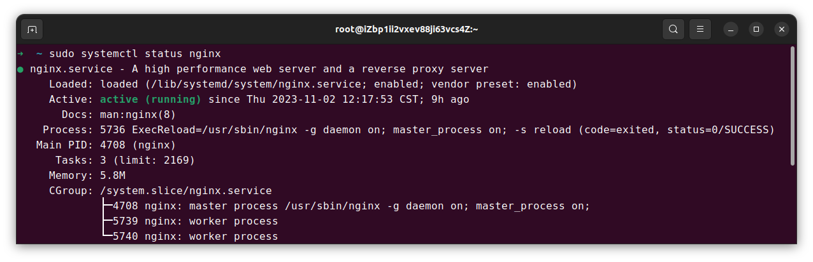
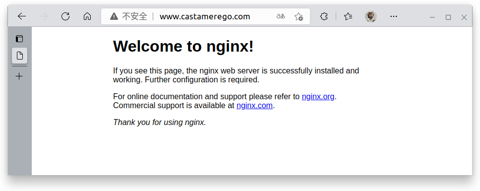
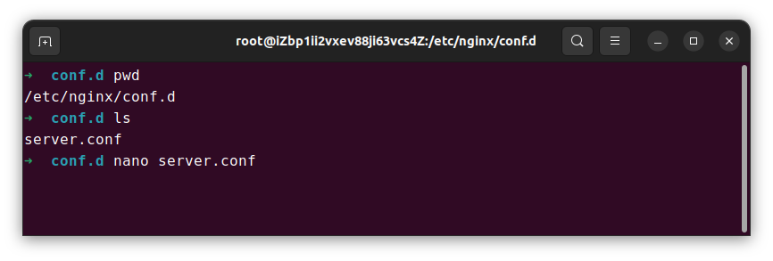

# Nginx反代理

**单个服务器部署多个项目的处理**

当使用HTTP服务器时，默认的端口号是80，但如果有多个项目想要部署在一个服务器上，如果都开到80端口就会出现端口占用，针对这个问题，笔者给出一个解决办法，即使用**Nginx反代理**

## 缘起

在我的服务器上一直部署着两个项目，一个开放在3000端口，一个在8500端口。之前采用的方法是将www.前缀的域名直接解析到服务器IP地址，然后再用两个不同的域名前缀使用**隐性URL转发**分别解析到www.<span></span>castamerego.com:3000和www.<span></span>castamerego.<span></span>com:8500。

使用隐性URL转发的好处是，在浏览器中显示的将是readbook.<span></span>castamerego.<span></span>com而不是www.<span></span>castamerego.com:3000的形式

:::tip

笔者使用的是**阿里云**的域名解析，他的域名解析类型还是比较多的，建议大家在使用前把[阿里云解析记录类型]先仔细看看

:::

之前在测试环境(localhost)都是正常的，但是在部署环境中没有仔细观察，使用隐性URL转发导致出现了以下两个问题:
+ 在网站内跳转时，无论到了站内哪个页面，页面URL都是固定的readbook.<span></span>castamerego.<span></span>com，而不是如readbook.<span></span>castamerego.<span></span>com/books的形式。
+ 由于隐性URL转发时，通过frame嵌套目标网站的内容，导致移动端不能自适应网页大小

## nginx
:::infoimportant
笔者服务器是Ubuntu20.04版本，这里演示在此OS上如何使用Nginx反代理
:::
### 安装

直接执行以下命令

```bash
sudo apt update
sudo apt install nginx
```
过程中可能需要输入密码，等安装好后，使用`sudo systemctl status nginx`命令查看，如果显示如下内容则安装成功



或者浏览器直接使用IP或者域名访问



### 配置反向代理

安装好Nginx后，先进入到Nginx配置文件夹，在Ubuntu下为`/etc/nginx/conf.d/`。cd过去后，创建一个新的.conf文件，笔者这里直接使用`nano server.conf`来创建并编辑

:::note

Nginx的配置文件其实是`/etc/nginx.conf`，在这个文件中会`include /etc/nginx/conf.d/*.conf`。也就是说Nginx会导入`conf.d`文件夹下所有的`.conf`格式文件。所以在这里创建的文件名随便起(笔者命名的是`server.conf`)，但必须是.conf文件

:::



在打开的.conf文件中添加以下内容，将`server_name`, `proxy_pass`换成你对应的域名和端口号(端口号要以 http://<span></span>localhost:1234的形式)

```python
server {
  listen 80;
  server_name App1.domain.com;  # 这里换成你解析的域名

  location / {
    proxy_pass http://localhost:xxxx; # 这里换成你该域名对应项目所在的端口号
  }
}

server {
  listen 80;
  server_name App2.domain.com;  # 这里换成你解析的域名

  location / {
    proxy_pass http://localhost:xxxx; # 这里换成你该域名对应项目所在的端口号
  }
}

# 如果不止两个项目就再加代理规则
```

添加好后，使用以下命令重启nginx服务以应用修改

```bash
sudo systemctl reload nginx
```

## 后记

去试试两个域名能否顺利打开对应的网站，域名解析可能会有一些延迟。完美解决之前提到的两个问题，实现单个服务器部署多个项目

[阿里云解析记录类型]:https://help.aliyun.com/document_detail/29725.html?spm=a2c1d.8251892.0.0.456d5b76vPKwlR#h2-url-6