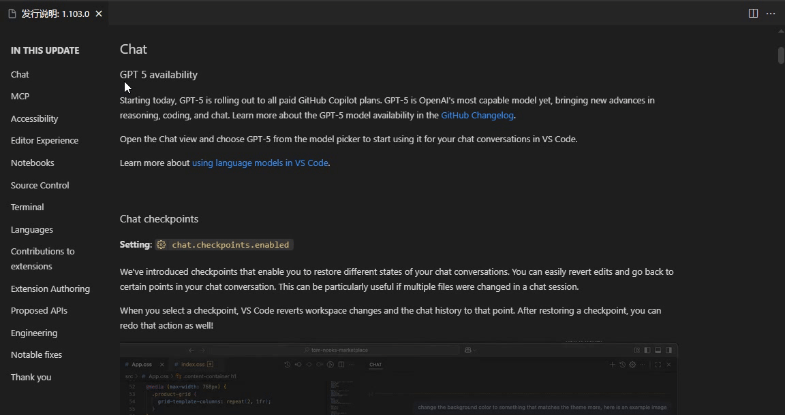
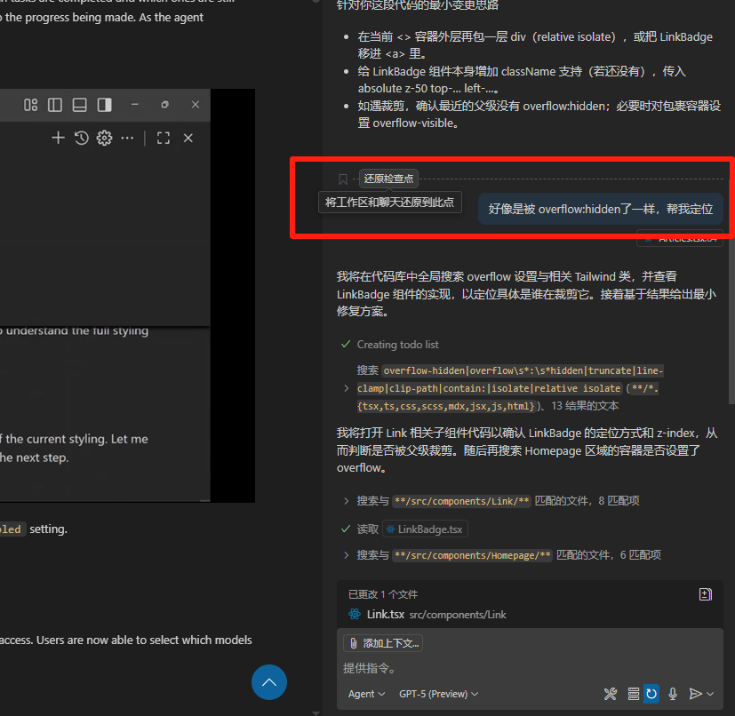
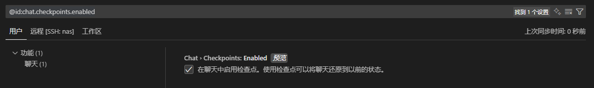
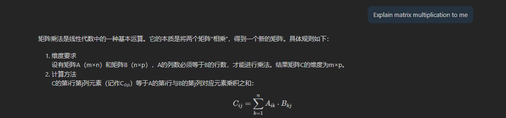
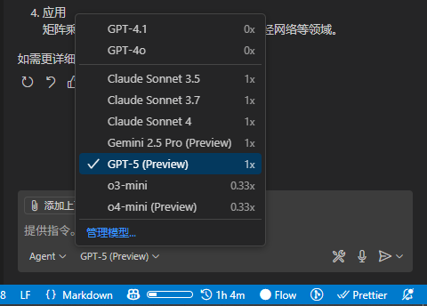

import { RoughNotation } from "react-rough-notation";

# Talk 001 · VScode / Copilot 25.08 Update

VS code launched August Update (V1.103.0). Copilot also updated GPT-5, Let's take a look

VS code Updates

- [Release Notes Page](/blog/talk-001#release-notes-page)
- [Show AI code percentage](/blog/talk-001#show-ai-code-percentage)

Copilot Updates

- [Chat checkpoints](/blog/talk-001#chat-checkpoints)
- [Progress List](/blog/talk-001#progress-list)
- [Katex Support](/blog/talk-001#katex-support)

I have only listed some updates that I find interesting (and often used myself). For the complete release notes, please refer to [here](https://code.visualstudio.com/updates/v1_103)

<!-- truncate -->

## VS Code Updates

As for AI updates, I will discuss them later with [Copilot Updates](/blog/talk-001#copilot-updates)

### Release Notes Page

A small optimization on Release Note Page: a convenient sidebar navigation

Every time I read the release notes, I jump to the terminal section first, then read from the beginning, which is indeed very convenient

### Show AI code percentage

The most fun in this update is this:

> AI vs Typing Average

A small percentage progress bar. Just a glance at it, makes you guilty about Tab Tab Tab, bloody genius

(Never show the data to your superior...)

## Copilot Updates

### Chat checkpoints

This new function is quite useful. Often in work, AI change the same file in a series of chats. If you didn't click `apply`, might that after one chat, the whole code just broke. And the previous useful code generated by AI could not be recovered

Now with new `Chat checkpoints`, you can directly go back to a certain point in the conversation

Just consider that each chat will be snapshotted. Those who have been through it will understand

search for  `@id:chat.checkpoints.enabled` in settings, apply it

### Progress List

When you assign a high-level problem to AI in agent mode, they will first devide the problem to multiple phases, and solve them sequentially

But things might go south. Sometimes AI just drifts away, and you don't know where it went

And today we got a new feature: After AI analyzes the promblem and breaks it down, they generate a todo list like this:

This is a better way to track AI's progress and save 'good' changes in time. Combined with the `Chat checkpoints` above, it might do works better

### Katex Support

Now formulas/equations in AI's reply will be rendered directly. Might be useful when checking them

## GPT-5

GPT-5 added into Copilot at 1x token cost on day 0 release. Let me try it out for a few days and see how it goes.

The total time cost (for one chat) seems to be unchanged. But the user experience got worse: after you ask a question, AI seems to think a lot longer, and responds a looot all at once, <RoughNotation type="strike-through" show={true} color="rgba(255, 0, 0, 0.7)" strokeWidth={4} iterations={1} multiline={true} >like a diarrhea</RoughNotation>

## Afterword

Full Release Note for VS code V1.103.0 can be found [here](https://code.visualstudio.com/updates/v1_103)