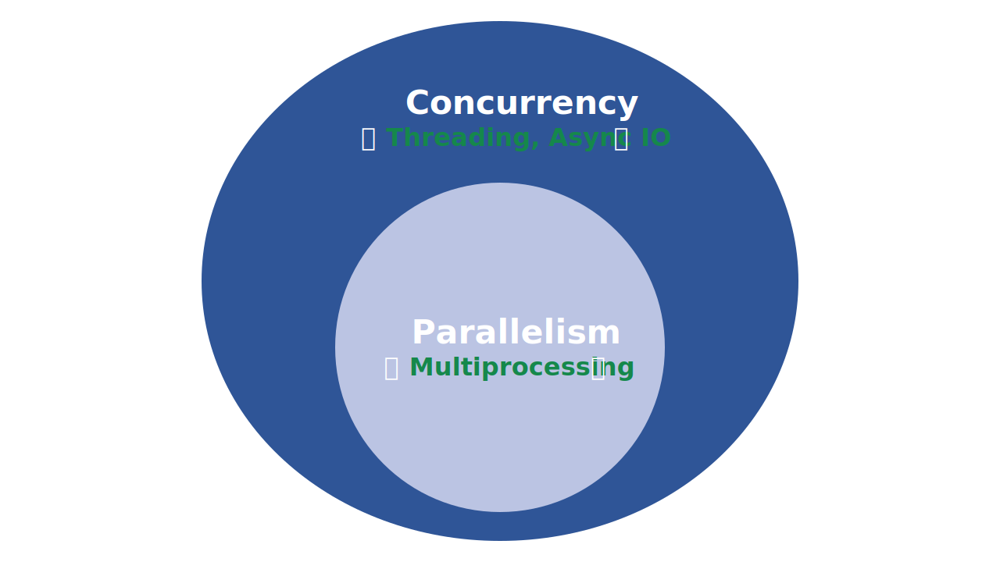
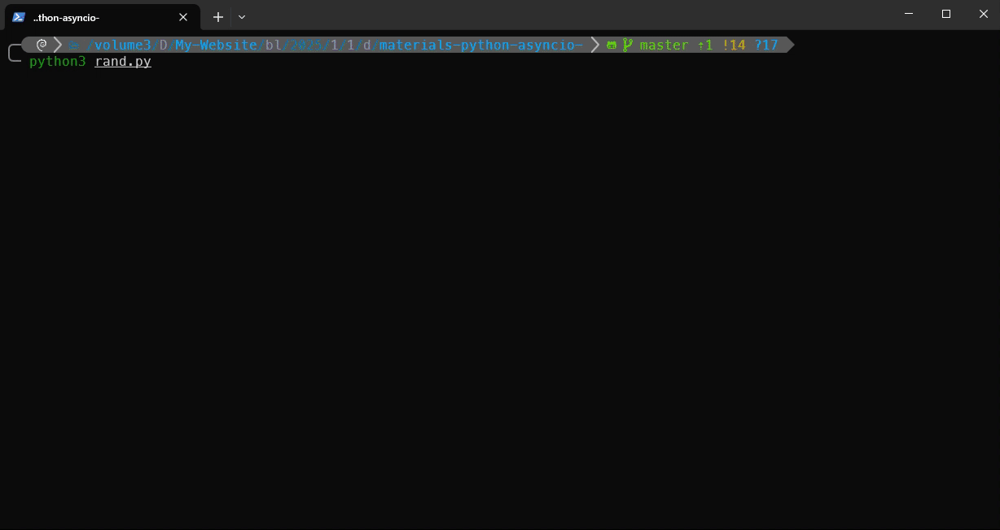

import Terminal from "./components/Terminal";
import Terminal1 from "./components/Terminal1";
import Terminal2 from "./components/Terminal2";
import Terminal3 from "./components/Terminal3";

Python’s `asyncio` library enables you to write concurrent code using the `async` and `await` keywords. The core building blocks of async I/O in Python are awaitable objects—most often coroutines—that an event loop schedules and executes asynchronously. This programming model lets you efficiently manage multiple I/O-bound tasks within a single thread of execution

In this tutorial, you’ll learn how Python `asyncio` works, how to define and run coroutines, and when to use asynchronous programming for better performance in applications that perform I/O-bound tasks

**By the end of this tutorial, you’ll understand that**:

- Python’s `asyncio` provides a framework for writing single-threaded **concurrent code** using **coroutines**, **event loops**, and **non-blocking I/O operations**
- For I/O-bound tasks, async I/O **can often outperform multithreading**—especially when managing a large number of concurrent tasks—because it avoids the overhead of thread management
- You should use `asyncio` when your application spends significant time waiting on **I/O operations**, such as network requests or file access, and you want to **run many of these tasks concurrently** without creating extra threads or processes

:::important
This Article is a repost of [Python's asyncio: A Hands-On Walkthrough](https://realpython.com/async-io-python/#other-async-io-features-in-python). **Only for Chinese Translation and no commercial use**. If any violation of copyright, please contact me to delete it
:::

<!-- truncate -->


# Python's asyncio: A Hands-On Walkthrough

:::tip
Get Your Code: [Click here](./demo/materials-python-asyncio-.zip) to download the free sample code that you’ll use to learn about async I/O in Python
:::

## A First Look at Async I/O

Before exploring `asyncio`, it’s worth taking a moment to compare async I/O with other concurrency models to see how it fits into Python’s broader, sometimes dizzying, landscape. Here are some essential concepts to start with:

- **Parallelism** consists of executing multiple operations at the same time
- **Multiprocessing** is a means of achieving parallelism that entails spreading tasks over a computer’s central processing unit (CPU) cores. Multiprocessing is well-suited for CPU-bound tasks, such as tightly bound [for loops](https://realpython.com/python-for-loop/) and mathematical computations
- **Concurrency** is a slightly broader term than parallelism, suggesting that multiple tasks have the ability to run in an overlapping manner. Concurrency doesn’t necessarily imply parallelism
- **Threading** is a concurrent execution model in which multiple threads take turns executing tasks. A single process can contain multiple threads. Python’s relationship with threading is complicated due to the [global interpreter lock (GIL)](https://realpython.com/python-gil/), but that’s beyond the scope of this tutorial

Threading is good for [I/O-bound tasks](https://realpython.com/ref/glossary/io-bound-task/). An I/O-bound job is dominated by a lot of waiting on [input/output (I/O)](https://realpython.com/ref/glossary/input-output/) to complete, while a [CPU-bound task](https://realpython.com/ref/glossary/cpu-bound-task/) is characterized by the computer’s cores continually working hard from start to finish

The Python [standard library](https://realpython.com/ref/glossary/standard-library/) has offered longstanding [support for these models](https://docs.python.org/3/library/concurrency.html) through its `multiprocessing`, `concurrent.futures`, and `threading` packages

Now it’s time to add a new member to the mix. In recent years, a separate model has been more comprehensively built into [CPython](https://realpython.com/cpython-source-code-guide/): **asynchronous I/O**, commonly called **async I/O**. This model is enabled through the standard library’s [`asyncio`](https://realpython.com/ref/stdlib/asyncio/) package and the [`async`](https://realpython.com/python-keywords/#the-async-keyword) and [`await`](https://realpython.com/python-keywords/#the-await-keyword) keywords

:::note
Async I/O isn’t a new concept. It exists in—or is being built into—other languages such as [Go](https://gobyexample.com/goroutines), [C#](https://docs.microsoft.com/en-us/dotnet/csharp/async), and [Rust](https://doc.rust-lang.org/book/ch17-00-async-await.html)
:::

The `asyncio` package is billed by the Python documentation as a [library to write concurrent code](https://docs.python.org/3/library/asyncio.html). However, async I/O isn’t threading or multiprocessing. It’s not built on top of either of these

Async I/O is a single-threaded, single-process technique that uses [cooperative multitasking](https://en.wikipedia.org/wiki/Cooperative_multitasking). Async I/O gives a feeling of concurrency despite using a single thread in a single process. [Coroutines](https://realpython.com/ref/glossary/coroutine/)—or **coro** for short—are a central feature of async I/O and can be scheduled concurrently, but they’re not inherently concurrent 

To reiterate, async I/O is a model of concurrent programming, but it’s not parallelism. It’s more closely aligned with threading than with multiprocessing, but it’s different from both and is a standalone member of the concurrency ecosystem

That leaves one more term. What does it mean for something to be **asynchronous**? This isn’t a rigorous definition, but for the purposes of this tutorial, you can think of two key properties:

1. **Asynchronous routines** can pause their execution while waiting for a result and allow other routines to run in the meantime
2. **Asynchronous code** facilitates the concurrent execution of tasks by coordinating asynchronous routines
 
Here’s a diagram that puts it all together. The white terms represent concepts, and the green terms represent the ways they’re implemented:



For a thorough exploration of threading versus multiprocessing versus async I/O, pause here and check out the [Speed Up Your Python Program With Concurrency](https://realpython.com/python-concurrency/) tutorial. For now, you’ll focus on async I/O

### Async I/O Explained

Async I/O may seem counterintuitive and paradoxical at first. How does something that facilitates concurrent code use a single thread in a single CPU core? Miguel Grinberg’s [PyCon](https://realpython.com/pycon-guide/) talk explains everything quite beautifully:

> Chess master Judit Polgár hosts a chess exhibition in which she plays multiple amateur players. She has two ways of conducting the exhibition: synchronously and asynchronously
> 
> Assumptions:
> - 24 opponents
> - Judit makes each chess move in 5 seconds
> - Opponents each take 55 seconds to make a move
> - Games average 30 pair-moves (60 moves total)
> 
> **Synchronous version**: Judit plays one game at a time, never two at the same time, until the game is complete. Each game takes (55 + 5) * 30 == 1800 seconds, or 30 minutes. The entire exhibition takes 24 * 30 == 720 minutes, or **12 hours**
> 
> **Asynchronous version**: Judit moves from table to table, making one move at each table. She leaves the table and lets the opponent make their next move during the wait time. One move on all 24 games takes Judit 24 * 5 == 120 seconds, or 2 minutes. The entire exhibition is now cut down to 120 * 30 == 3600 seconds, or just **1 hour**. ([Source](https://youtu.be/iG6fr81xHKA?t=4m29s))

There’s only one Judit Polgár, who makes only one move at a time. Playing asynchronously cuts the exhibition time down from 12 hours to 1 hour. Async I/O applies this principle to programming. In async I/O, a program’s event loop—more on that later—runs multiple tasks, allowing each to take turns running at the optimal time

Async I/O takes long-running [functions](https://realpython.com/defining-your-own-python-function/)—like a complete chess game in the example above—that would block a program’s execution (Judit Polgár’s time). It manages them in a way so other functions can run during that downtime. In the chess example, Judit Polgár plays with another participant while the previous ones make their moves

### Async I/O Isn’t Simple

Building durable multithreaded code can be challenging and prone to errors. Async I/O avoids some of the potential speed bumps you might encounter with a multithreaded design. However, that’s not to say that [asynchronous programming](https://realpython.com/ref/glossary/asynchronous-programming/) is a simple task in Python

Be aware that async programming can get tricky when you venture a bit below the surface level. Python’s async model is built around concepts such as callbacks, coroutines, events, transports, protocols, and [futures](https://docs.python.org/3/library/asyncio-future.html#asyncio.Future)—even just the terminology can be intimidating

That said, the ecosystem around async programming in Python has improved significantly. The `asyncio` package has matured and now provides a stable [API](https://realpython.com/ref/glossary/api/). Additionally, its documentation has received a considerable overhaul, and some high-quality resources on the subject have also emerged

## Async I/O in Python With `asyncio`

Now that you have some background on async I/O as a concurrency model, it’s time to explore Python’s implementation. Python’s `asyncio` package and its two related keywords, [`async`](https://realpython.com/python-keywords/#the-async-keyword) and [`await`](https://realpython.com/python-keywords/#the-await-keyword), serve different purposes but come together to help you declare, build, execute, and manage asynchronous code

### Coroutines and Coroutine Functions

At the heart of async I/O is the concept of a [**coroutine**](https://realpython.com/ref/glossary/coroutine/), which is an object that can suspend its execution and resume it later. In the meantime, it can pass the control to an event loop, which can execute another coroutine. Coroutine objects result from calling a [**coroutine function**](https://realpython.com/ref/glossary/coroutine-function/), also known as an **asynchronous function**. You define one with the `async def` construct

Before writing your first piece of asynchronous code, consider the following example that runs synchronously:

```python title="synchronous.py" showLineNumbers
import time

def count():
    print("One")
    time.sleep(1)
    print("Two")
    time.sleep(1)

def main():
    for _ in range(3):
        count()

if __name__ == "__main__":
    start = time.perf_counter()
    main()
    elapsed = time.perf_counter() - start
    print(f"{__file__} executed in {elapsed:0.2f} seconds.")
```

The `count()` function [prints](https://realpython.com/python-print/) `One` and waits for a second, then prints `Two` and waits for another second. The loop in the [main()](https://realpython.com/python-main-function/) function executes count() three times. Below, in the [if __name__ == "__main__"](https://realpython.com/if-name-main-python/) condition, you take a snapshot of the current time at the beginning of the execution, call main(), compute the total time, and display it on the screen

When you [run this script](https://realpython.com/run-python-scripts/), you’ll get the following output:

<Terminal />

The script prints `One` and `Two` alternatively, taking a second between each printing operation. In total, it takes a bit more than six seconds to run

If you update this script to use Python’s async I/O model, then it would look something like the following

```python title="countasync.py" showLineNumbers
import asyncio

async def count():
    print("One")
    await asyncio.sleep(1)
    print("Two")
    await asyncio.sleep(1)

async def main():
    await asyncio.gather(count(), count(), count())

if __name__ == "__main__":
    import time

    start = time.perf_counter()
    asyncio.run(main())
    elapsed = time.perf_counter() - start
    print(f"{__file__} executed in {elapsed:0.2f} seconds.")
```

Now, you use the `async` keyword to turn `count()` into a coroutine function that prints `One`, waits for one second, then prints `Two`, and waits another second. You use the `await` keyword to *await* the execution of `asyncio.sleep()`. This gives the control back to the program’s event loop, saying: *I will sleep for one second. Go ahead and run something else in the meantime*

The `main()` function is another coroutine function that uses [`asyncio.gather()`](https://realpython.com/async-io-python/#other-asyncio-tools) to run three instances of `count()` concurrently. You use the `asyncio.run()` function to launch the [event loop](https://realpython.com/async-io-python/#the-async-io-event-loop) and execute `main()`

Compare the performance of this version to that of the synchronous version:

<Terminal1 />

Thanks to the async I/O approach, the total execution time is just over two seconds instead of six, demonstrating the efficiency of `asyncio` for I/O-bound tasks

While using `time.sleep()` and `asyncio.sleep()` may seem banal, they serve as stand-ins for time-intensive processes that involve wait time. A call to `time.sleep()` can represent a time-consuming blocking function call, while `asyncio.sleep()` is used to stand in for a [non-blocking call](https://realpython.com/ref/glossary/non-blocking-operation/) that also takes some time to complete

As you’ll see in the next section, the benefit of awaiting something, including `asyncio.sleep()`, is that the surrounding function can temporarily cede control to another function that’s more readily able to do something immediately. In contrast, `time.sleep()` or any other blocking call is incompatible with asynchronous Python code because it stops everything in its tracks for the duration of the sleep time

### The `async` and `await` Keywords

At this point, a more formal definition of `async`, `await`, and the coroutine functions they help you create is in order

- The `async def` syntax construct introduces either a `coroutine function` or an [**asynchronous generator**](https://realpython.com/ref/glossary/asynchronous-generator/)
- The `async with` and `async for` syntax constructs introduce asynchronous `with statements` and `for` **loops**, respectively
- The **`await`** keyword suspends the execution of the surrounding coroutine and passes control back to the event loop

To clarify the last point a bit, when Python encounters an `await f()` expression in the scope of a `g()` coroutine, `await` tells the event loop: *suspend the execution of g() until the result of f() is returned. In the meantime, let something else run*

In code, that last bullet point looks roughly like the following:

```python
async def g():
    result = await f()  # Pause and come back to g() when f() returns
    return result
```

There’s also a strict set of rules around when and how you can use `async` and `await`. These rules are helpful whether you’re still picking up the syntax or already have exposure to using `async` and `await`:

- Using the `async def` construct, you can define a coroutine function. It may use `await`, `return`, or `yield`, but all of these are optional:
  - `await`, `return`, or both can be used in regular coroutine functions. To call a coroutine function, you must either `await` it to get its result or run it directly in an event loop
  - `yield` used in an `async def `function creates an asynchronous generator. To iterate over this generator, you can use an [`async for` loop or a comprehension](https://realpython.com/async-io-python/#async-iterators-loops-and-comprehensions)
  - `async def` may not use `yield from`, which will raise a [`SyntaxError`](https://realpython.com/invalid-syntax-python/)
- Using `await` outside of an `async def` function also raises a `SyntaxError`. You can only use `await` in the body of coroutines

Here are some terse examples that summarize these rules:

```python title="summary" showLineNumbers
async def f(x):
    y = await z(x)  # Okay - `await` and `return` allowed in coroutines
    return y

async def g(x):
    yield x  # Okay - this is an async generator

async def m(x):
    yield from gen(x)  # No - SyntaxError

def n(x):
    y = await z(x)  # No - SyntaxError (no `async def` here)
    return y
```

Finally, when you use `await f()`, it’s required that `f()` be an object that’s [**awaitable**](https://realpython.com/ref/glossary/awaitable/), which is either another coroutine or an object defining an `.__await__()` [special method](https://realpython.com/python-magic-methods/) that returns an iterator. For most purposes, you should only need to worry about coroutines

Here’s a more elaborate example of how async I/O cuts down on wait time. Suppose you have a coroutine function called `make_random()` that keeps producing random integers in the range [0, 10] and returns when one of them exceeds a threshold. In the following example, you run this function asynchronously three times. To differentiate each call, you use colors:

```python title="rand.py" showLineNumbers
import asyncio
import random

COLORS = (
    "\033[0m",  # End of color
    "\033[36m",  # Cyan
    "\033[91m",  # Red
    "\033[35m",  # Magenta
)

async def main():
    return await asyncio.gather(
        makerandom(1, 9),
        makerandom(2, 8),
        makerandom(3, 8),
    )

async def makerandom(delay, threshold=6):
    color = COLORS[delay]
    print(f"{color}Initiated makerandom({delay}).")
    while (number := random.randint(0, 10)) <= threshold:
        print(f"{color}makerandom({delay}) == {number} too low; retrying.")
        await asyncio.sleep(delay)
    print(f"{color}---> Finished: makerandom({delay}) == {number}" + COLORS[0])
    return number

if __name__ == "__main__":
    random.seed(444)
    r1, r2, r3 = asyncio.run(main())
    print()
    print(f"r1: {r1}, r2: {r2}, r3: {r3}")
```

The colorized output speaks louder than a thousand words. Here’s how this script is carried out:



This program defines the `makerandom()` coroutine and runs it concurrently with three different inputs. Most programs will consist of small, modular coroutines and a wrapper function that serves to [chain](https://realpython.com/async-io-python/#coroutine-chaining) each smaller coroutine. In `main()`, you gather the three tasks. The three calls to `makerandom()` are your **pool of tasks**

While the random number generation in this example is a CPU-bound task, its impact is negligible. The `asyncio.sleep()` simulates an I/O-bound task and makes the point that only I/O-bound or non-blocking tasks benefit from the async I/O model

### The Async I/O Event Loop

In asynchronous programming, an event loop is like an [infinite loop](https://realpython.com/python-while-loop/#intentional-infinite-loops) that monitors coroutines, takes feedback on what’s idle, and looks around for things that can be executed in the meantime. It’s able to wake up an idle coroutine when whatever that coroutine is waiting for becomes available

The recommended way to start an event loop in modern Python is to use [`asyncio.run()`](https://docs.python.org/3/library/asyncio-runner.html#asyncio.run). This function is responsible for getting the event loop, running tasks until they complete, and closing the loop. You can’t call this function when another async event loop is running in the same code

You can also get an instance of the running loop with the [`get_running_loop()`](https://docs.python.org/3/library/asyncio-eventloop.html#asyncio.get_running_loop) function:

```python
loop = asyncio.get_running_loop()
```

If you need to interact with the event loop within a Python program, the above pattern is a good way to do it. The `loop` object supports introspection with `.is_running()` and `.is_closed()`. It can be useful when you want to [schedule a callback](https://docs.python.org/3/library/asyncio-eventloop.html#asyncio-example-lowlevel-helloworld) by passing the loop as an argument, for example. Note that `get_running_loop()` raises a [`RuntimeError`](https://realpython.com/ref/builtin-exceptions/runtimeerror/) exception if there’s no running event loop

What’s more important is understanding what goes on beneath the surface of the event loop. Here are a few points worth stressing:

- Coroutines don’t do much on their own until they’re tied to the event loop
- By default, an async event loop runs in a single thread and on a single CPU core. In most `asyncio` applications, there will be only one event loop, typically in the main thread. Running multiple event loops in different threads is technically possible, but not commonly needed or recommended
- Event loops are pluggable. You can write your own implementation and have it run tasks just like the event loops provided in `asyncio`

Regarding the first point, if you have a coroutine that awaits others, then calling it in isolation has little effect:

```python
>>> import asyncio

>>> async def main():
...     print("Hello...")
...     await asyncio.sleep(1)
...     print("World!")
...

>>> routine = main()
>>> routine
<coroutine object main at 0x1027a6150>
```

In this example, calling `main()` directly returns a coroutine object that you can’t use in isolation. You need to use `asyncio.run()` to schedule the `main()` coroutine for execution on the event loop:

```python
>>> asyncio.run(routine)
Hello...
World!
```

You typically wrap your `main()` coroutine in an `asyncio.run()` call. You can execute lower-level coroutines with `await`

Finally, the fact that the event loop is *pluggable* means that you can use any working implementation of an event loop, and that’s unrelated to your structure of coroutines. The `asyncio` package ships with two different [event loop implementations](https://docs.python.org/3/library/asyncio-eventloop.html#event-loop-implementations)

The default event loop implementation depends on your platform and Python version. For example, on Unix, the default is typically [SelectorEventLoop](https://docs.python.org/3/library/asyncio-eventloop.html#asyncio.SelectorEventLoop), while Windows uses [ProactorEventLoop](https://docs.python.org/3/library/asyncio-eventloop.html#asyncio.ProactorEventLoop) for better subprocess and I/O support

Third-party event loops are also available. For example, the [uvloop](https://github.com/MagicStack/uvloop) package provides an alternative implementation that promises to be faster than the `asyncio` loops

### The `asyncio` REPL

Starting with [Python 3.8](https://realpython.com/python38-new-features/), the `asyncio` module includes a specialized interactive shell known as the [asyncio REPL](https://docs.python.org/3/library/asyncio.html#asyncio-cli). This environment allows you to use `await` directly at the top level, without wrapping your code in a call to `asyncio.run()`. This tool facilitates experimenting, debugging, and learning about `asyncio` in Python

To start the [REPL](https://realpython.com/ref/glossary/repl/), you can run the following command:

```
$ python -m asyncio
asyncio REPL 3.13.3 (main, Jun 25 2025, 17:27:59) ... on darwin
Use "await" directly instead of "asyncio.run()".
Type "help", "copyright", "credits" or "license" for more information.
>>> import asyncio
>>>
```

Once you get the >>> prompt, you can start running asynchronous code there. Consider the example below, where you reuse the code from the previous section:

```python title="asyncio repl"
>>> import asyncio

>>> async def main():
...     print("Hello...")
...     await asyncio.sleep(1)
...     print("World!")
...

>>> await main()
Hello...
World!
```

This example works the same as the one in the previous section. However, instead of running `main()` using `asyncio.run()`, you use `await` directly

## Common Async I/O Programming Patterns

Async I/O has its own set of possible programming patterns that allow you to write better asynchronous code. In practice, you can *chain coroutines* or use a [queue](https://realpython.com/ref/glossary/queue/) of coroutines. You’ll learn how to use these two patterns in the following sections

### Coroutine Chaining

A key feature of coroutines is that you can *chain* them together. Remember, a coroutine is awaitable, so another coroutine can await it using the `await` keyword. This makes it easier to break your program into smaller, manageable, and reusable coroutines

The example below simulates a two-step process that fetches information about a user. The first step fetches the user information, and the second step fetches their published posts:

```python title="chain.py" showLineNumbers
import asyncio
import random
import time

async def main():
    user_ids = [1, 2, 3]
    start = time.perf_counter()
    await asyncio.gather(
        *(get_user_with_posts(user_id) for user_id in user_ids)
    )
    end = time.perf_counter()
    print(f"\n==> Total time: {end - start:.2f} seconds")

async def get_user_with_posts(user_id):
    user = await fetch_user(user_id)
    await fetch_posts(user)

async def fetch_user(user_id):
    delay = random.uniform(0.5, 2.0)
    print(f"User coro: fetching user by {user_id=}...")
    await asyncio.sleep(delay)
    user = {"id": user_id, "name": f"User{user_id}"}
    print(f"User coro: fetched user with {user_id=} (done in {delay:.1f}s).")
    return user

async def fetch_posts(user):
    delay = random.uniform(0.5, 2.0)
    print(f"Post coro: retrieving posts for {user['name']}...")
    await asyncio.sleep(delay)
    posts = [f"Post {i} by {user['name']}" for i in range(1, 3)]
    print(
        f"Post coro: got {len(posts)} posts by {user['name']}"
        f" (done in {delay:.1f}s):"
    )
    for post in posts:
        print(f" - {post}")

if __name__ == "__main__":
    random.seed(444)
    asyncio.run(main())
```

In this example, you define two major coroutines: `fetch_user()` and `fetch_posts()`. Both simulate a network call with a random delay using `asyncio.sleep()`

In the `fetch_user()` coroutine, you return a mock user [dictionary](https://realpython.com/python-dicts/). In `fetch_posts()`, you use that dictionary to return a list of mock posts attributed to the user at hand. Random delays simulate real-world asynchronous behavior like network latency

The coroutine chaining happens in the `get_user_with_posts()`. This coroutine awaits `fetch_user()` and stores the result in the user [variable](https://realpython.com/python-variables/). Once the user information is available, it’s passed to `fetch_posts()` to retrieve the posts asynchronously

In `main()`, you use `asyncio.gather()` to run the chained coroutines by executing `get_user_with_posts()` as many times as the number of user IDs you have

Here’s the result of executing the script:

<Terminal2 />

If you sum up the time of all the operations, then this example would take around 7.6 seconds with a synchronous implementation. However, with the asynchronous implementation, it only takes 2.68 seconds

The pattern, consisting of awaiting one coroutine and passing its result into the next, creates a **coroutine chain**, where each step depends on the previous one. This example mimics a common async workflow where you get one piece of information and use it to get related data

### Coroutine and Queue Integration

The `asyncio` package provides a few [queue-like classes](https://realpython.com/queue-in-python/#using-asynchronous-queues) that are designed to be similar to [classes](https://realpython.com/python-classes/) in the [queue](https://docs.python.org/3/library/queue.html#module-queue) module. In the examples so far, you haven’t needed a queue structure. In `chained.py`, each task is performed by a coroutine, which you chain with others to pass data from one to the next

An alternative approach is to use **producers** that add items to a [queue](https://realpython.com/ref/glossary/queue/). Each producer may add multiple items to the queue at staggered, random, and unannounced times. Then, a group of **consumers** pulls items from the queue as they show up, greedily and without waiting for any other signal

In this design, there’s no chaining between producers and consumers. Consumers don’t know the number of producers, and vice versa

It takes an individual producer or consumer a variable amount of time to add and remove items from the queue. The queue serves as a throughput that can communicate with the producers and consumers without them talking to each other directly

A queue-based version of chained.py is shown below:

```python title="chained.py" showLineNumbers
import asyncio
import random
import time

async def main():
    queue = asyncio.Queue()
    user_ids = [1, 2, 3]

    start = time.perf_counter()
    await asyncio.gather(
        producer(queue, user_ids),
        *(consumer(queue) for _ in user_ids),
    )
    end = time.perf_counter()
    print(f"\n==> Total time: {end - start:.2f} seconds")

async def producer(queue, user_ids):
    async def fetch_user(user_id):
        delay = random.uniform(0.5, 2.0)
        print(f"Producer: fetching user by {user_id=}...")
        await asyncio.sleep(delay)
        user = {"id": user_id, "name": f"User{user_id}"}
        print(f"Producer: fetched user with {user_id=} (done in {delay:.1f}s)")
        await queue.put(user)

    await asyncio.gather(*(fetch_user(uid) for uid in user_ids))
    for _ in range(len(user_ids)):
        await queue.put(None)  # Sentinels for consumers to terminate

async def consumer(queue):
    while True:
        user = await queue.get()
        if user is None:
            break
        delay = random.uniform(0.5, 2.0)
        print(f"Consumer: retrieving posts for {user['name']}...")
        await asyncio.sleep(delay)
        posts = [f"Post {i} by {user['name']}" for i in range(1, 3)]
        print(
            f"Consumer: got {len(posts)} posts by {user['name']}"
            f" (done in {delay:.1f}s):"
        )
        for post in posts:
            print(f"  - {post}")

if __name__ == "__main__":
    random.seed(444)
    asyncio.run(main())
```

In this example, the `producer()` function asynchronously fetches mock user data. Each fetched user dictionary is placed into an `asyncio.Queue` object, which shares the data with consumers. After producing all user objects, the producer inserts a [sentinel value](https://en.wikipedia.org/wiki/Sentinel_value)—also known as a [poison pill](https://realpython.com/queue-in-python/#killing-a-worker-with-the-poison-pill) in this context—for each consumer to signal that no more data will be sent, allowing the consumers to shut down cleanly

The `consumer()` function continuously reads from the queue. If it receives a user dictionary, it simulates fetching that user’s posts, waits a random delay, and prints the results. If it gets the sentinel value, then it breaks the loop and exits

This decoupling allows multiple consumers to process users concurrently, even while the producer is still generating users, and the queue ensures safe and ordered communication between producers and consumers

The queue is the communication point between the producers and consumers, enabling a scalable and responsive system

Here’s how the code works in practice:

<Terminal3 />

Again, the code runs in only 2.68 seconds, which is more efficient than a synchronous solution. The result is pretty much the same as when you used chained coroutines in the previous section

## Other Async I/O Features in Python

Python’s async I/O features extend beyond the `async def` and `await` constructs. They include other advanced tools that make asynchronous programming more expressive and consistent with regular Python constructs

In the following sections, you’ll explore powerful async features, including async loops and comprehensions, the `async with` statement, and exception groups. These features will help you write cleaner, more readable asynchronous code

### Async Iterators, Loops, and Comprehensions

Apart from using `async` and `await` to create coroutines, Python also provides the `async for` construct to iterate over an [asynchronous iterator](https://realpython.com/ref/glossary/asynchronous-iterator/). An asynchronous iterator allows you to iterate over asynchronously generated data. While the loop runs, it gives control back to the event loop so that other async tasks can run

:::note
Note: To learn more about async iterators, check out the [Asynchronous Iterators and Iterables in Python](https://realpython.com/python-async-iterators/) tutorial
:::

A natural extension of this concept is an [**asynchronous generator**](https://realpython.com/ref/glossary/asynchronous-generator/). Here’s an example that generates powers of two and uses them in a loop and comprehension:

```python title="asynchronous generator" showLineNumbers
>>> import asyncio

>>> async def powers_of_two(stop=10):
...     exponent = 0
...     while exponent < stop:
...         yield 2**exponent
...         exponent += 1
...         await asyncio.sleep(0.2)  # Simulate some asynchronous work
...

>>> async def main():
...     g = []
...     async for i in powers_of_two(5):
...         g.append(i)
...     print(g)
...     f = [j async for j in powers_of_two(5) if not (j // 3 % 5)]
...     print(f)
...

>>> asyncio.run(main())
[1, 2, 4, 8, 16]
[1, 2, 16]
```

There’s a crucial distinction between synchronous and asynchronous generators, loops, and comprehensions. Their asynchronous counterparts don’t inherently make iteration concurrent. Instead, they allow the event loop to run other tasks between iterations when you explicitly yield control by using `await`. The iteration itself is still sequential unless you introduce concurrency by using `asyncio.gather()`

Using `async for` and `async with` is only required when working with asynchronous iterators or context managers, where a regular `for` or `with` would raise errors

### Async `with` Statements

The [`with` statement](https://realpython.com/python-with-statement/) also has an [asynchronous](https://realpython.com/ref/glossary/asynchronous-programming/) version, `async with`. This construct is quite common in async code, as many [I/O-bound tasks](https://realpython.com/ref/glossary/io-bound-task/) involve setup and teardown phases

For example, say you need to write a coroutine to check whether some websites are online. To do that, you can use [aiohttp](https://docs.aiohttp.org/en/stable/index.html), which is a third-party library that you need to install by running `python -m pip install aiohttp` on your command line

Here’s a quick example that implements the required functionality:

```python title="async with" showLineNumbers
>>> import asyncio
>>> import aiohttp

>>> async def check(url):
...     async with aiohttp.ClientSession() as session:
...         async with session.get(url) as response:
...             print(f"{url}: status -> {response.status}")
...

>>> async def main():
...     websites = [
...         "https://realpython.com",
...         "https://pycoders.com",
...         "https://www.python.org",
...     ]
...     await asyncio.gather(*(check(url) for url in websites))
...

>>> asyncio.run(main())
https://www.python.org: status -> 200
https://pycoders.com: status -> 200
https://realpython.com: status -> 200
```

In this example, you use `aiohttp` and `asyncio` to perform concurrent [HTTP GET](https://realpython.com/api-integration-in-python/#get) requests to a list of websites. The `check()` coroutine fetches and prints the website’s status. The `async with` statement ensures that both `ClientSession` and the individual HTTP response are properly and asynchronously managed by opening and closing them without blocking the event loop

In this example, using `async with` guarantees that the underlying network resources, including connections and sockets, are correctly released, even if an error occurs

Finally, `main()` runs the `check()` coroutines concurrently, allowing you to fetch the URLs in parallel without waiting for one to finish before starting the next

### Other `asyncio` Tools

In addition to `asyncio.run()`, you’ve used a few other package-level functions, such as `asyncio.gather()` and `asyncio.get_event_loop()`. You can use [`asyncio.create_task()`](https://docs.python.org/3/library/asyncio-task.html#asyncio.create_task) to schedule the execution of a coroutine object, followed by the usual call to the `asyncio.run()` function:

```python title="asyncio" showLineNumbers
>>> import asyncio

>>> async def coro(numbers):
...     await asyncio.sleep(min(numbers))
...     return list(reversed(numbers))
...

>>> async def main():
...     task = asyncio.create_task(coro([3, 2, 1]))
...     print(f"{type(task) = }")
...     print(f"{task.done() = }")
...     return await task
...

>>> result = asyncio.run(main())
type(task) = <class '_asyncio.Task'>
task.done() = False
>>> print(f"result: {result}")
result: [1, 2, 3]
```

This pattern includes a subtle detail you need to be aware of: if you create tasks with `create_task()` but don’t await them or wrap them in `gather()`, and your `main()` coroutine finishes, then those manually created tasks will be canceled when the event loop ends. You must await all tasks you want to complete

The `create_task()` function wraps an awaitable object into a higher-level [`Task`](https://docs.python.org/3/library/asyncio-task.html#asyncio.Task) object that’s scheduled to run concurrently on the event loop in the background. In contrast, awaiting a coroutine runs it immediately, pausing the execution of the caller until the awaited coroutine finishes

The `gather()` function is meant to neatly put a collection of coroutines into a single **future object**. This object represents a placeholder for a result that’s initially unknown but will be available at some point, typically as the result of asynchronous computations

If you await `gather()` and specify multiple tasks or coroutines, then the loop will wait for all the tasks to complete. The result of `gather()` will be a list of the results across the inputs:

```python title="gather" showLineNumbers
>>> import time

>>> async def main():
...     task1 = asyncio.create_task(coro([10, 5, 2]))
...     task2 = asyncio.create_task(coro([3, 2, 1]))
...     print("Start:", time.strftime("%X"))
...     result = await asyncio.gather(task1, task2)
...     print("End:", time.strftime("%X"))
...     print(f"Both tasks done: {all((task1.done(), task2.done()))}")
...     return result
...

>>> result = asyncio.run(main())
Start: 14:38:49
End: 14:38:51
Both tasks done: True

>>> print(f"result: {result}")
result: [[2, 5, 10], [1, 2, 3]]
```

You probably noticed that `gather()` waits for the entire result of the whole set of coroutines that you pass it. The order of results from `gather()` is deterministic and corresponds to the order of awaitables originally passed to it

Alternatively, you can loop over `asyncio.as_completed()` to get tasks as they complete. The function returns a synchronous iterator that yields tasks as they finish. Below, the result of `coro([3, 2, 1])` will be available before `coro([10, 5, 2])` is complete, which wasn’t the case with the `gather()` function:

```python title="asyncio.as_completed()" showLineNumbers
>>> async def main():
...     task1 = asyncio.create_task(coro([10, 5, 2]))
...     task2 = asyncio.create_task(coro([3, 2, 1]))
...     print("Start:", time.strftime("%X"))
...     for task in asyncio.as_completed([task1, task2]):
...         result = await task
...         print(f'result: {result} completed at {time.strftime("%X")}')
...     print("End:", time.strftime("%X"))
...     print(f"Both tasks done: {all((task1.done(), task2.done()))}")
...

>>> asyncio.run(main())
Start: 14:36:36
result: [1, 2, 3] completed at 14:36:37
result: [2, 5, 10] completed at 14:36:38
End: 14:36:38
Both tasks done: True
```

In this example, the `main()` function uses `asyncio.as_completed()`, which yields tasks in the order they complete, not in the order they were started. As the program loops through the tasks, it awaits them, allowing the results to be available immediately upon completion

As a result, the faster task (`task1`) finishes first and its result is printed earlier, while the longer task (`task2`) completes and prints afterward. The `as_completed()` function is useful when you need to handle tasks dynamically as they finish, which improves responsiveness in concurrent workflows

### Async Exception Handling

Starting with [Python 3.11](https://realpython.com/python311-new-features/), you can use the [ExceptionGroup](https://realpython.com/python311-exception-groups/) class to handle multiple unrelated exceptions that may occur concurrently. This is especially useful when running multiple coroutines that can raise different exceptions. Additionally, the new `except*` syntax helps you gracefully deal with several errors at once

Here’s a quick demo of how to use this class in asynchronous code:

```python title="3.11+" showLineNumbers
>>> import asyncio

>>> async def coro_a():
...     await asyncio.sleep(1)
...     raise ValueError("Error in coro A")
...

>>> async def coro_b():
...     await asyncio.sleep(2)
...     raise TypeError("Error in coro B")
...

>>> async def coro_c():
...     await asyncio.sleep(0.5)
...     raise IndexError("Error in coro C")
...

>>> async def main():
...     results = await asyncio.gather(
...         coro_a(),
...         coro_b(),
...         coro_c(),
...         return_exceptions=True
...     )
...     exceptions = [e for e in results if isinstance(e, Exception)]
...     if exceptions:
...         raise ExceptionGroup("Errors", exceptions)
...
```

In this example, you have three coroutines that raise three different types of [exceptions](https://realpython.com/python-built-in-exceptions/). In the `main()` function, you call `gather()` with the coroutines as arguments. You also set the `return_exceptions` argument to `True` so that you can grab the exceptions if they occur

Next, you use a list comprehension to store the exceptions in a new list. If the list contains at least one exception, then you create an `ExceptionGroup` for them

To handle this exception group, you can use the following code:

```python title="python 3.11+" showLineNumbers
>>> try:
...     asyncio.run(main())
... except* ValueError as ve_group:
...     print(f"[ValueError handled] {ve_group.exceptions}")
... except* TypeError as te_group:
...     print(f"[TypeError handled] {te_group.exceptions}")
... except* IndexError as ie_group:
...     print(f"[IndexError handled] {ie_group.exceptions}")
...
[ValueError handled] (ValueError('Error in coro A'),)
[TypeError handled] (TypeError('Error in coro B'),)
[IndexError handled] (IndexError('Error in coro C'),)
```

In this code, you wrap the call to `asyncio.run()` in a [`try`](https://realpython.com/ref/keywords/try/) block. Then, you use the `except*` syntax to catch the expected exception separately. In each case, you print an error message to the screen

## Async I/O in Context

Now that you’ve seen a healthy dose of asynchronous code, take a moment to step back and consider when async I/O is the ideal choice—and how to evaluate whether it’s the right fit or if another concurrency model might be better

### When to Use Async I/O

Using `async def` for functions that perform blocking operations—such as standard file I/O or synchronous network requests—will block the entire event loop, negate the benefits of async I/O, and potentially reduce your program’s efficiency. Only use `async def` functions for [non-blocking operations](https://realpython.com/ref/glossary/non-blocking-operation/)

The battle between async I/O and multiprocessing isn’t a real battle. You can use both models [in concert](https://youtu.be/0kXaLh8Fz3k?t=10m30s) if you want. In practice, multiprocessing should be the right choice if you have multiple CPU-bound tasks

The contest between async I/O and threading is more direct. Threading isn’t simple, and even in cases where threading seems easy to implement, it can still lead to hard-to-trace bugs due to [race conditions](https://realpython.com/python-thread-lock/#race-conditions) and memory usage, among other things

Threading also tends to scale less elegantly than async I/O because threads are a system resource with a finite availability. Creating thousands of threads will fail on many machines or can slow down your code. In contrast, creating thousands of async I/O tasks is completely feasible

Async I/O shines when you have multiple I/O-bound tasks that would otherwise be dominated by blocking wait time, such as:

- **Network I/O**, whether your program is acting as the server or the client
- **Serverless designs**, such as a peer-to-peer, multi-user network like a group chat
- **Read/write operations** where you want to mimic a [fire-and-forget](https://en.wikipedia.org/wiki/Fire-and-forget) style approach without worrying about holding a lock on the resource

The biggest reason not to use async I/O is that `await` only supports a specific set of objects that define a particular set of methods. For example, if you want to do async read operations on a certain [database management system (DBMS)](https://en.wikipedia.org/wiki/Database#Database_management_system), then you’ll need to find a Python wrapper for that DBMS that supports the `async` and `await` syntax

### Libraries Supporting Async I/O

You’ll find several high-quality third-party libraries and frameworks that support or are built on top of `asyncio` in Python, including tools for web servers, databases, networking, testing, and more. Here are some of the most notable:

- Web frameworks:
  - [FastAPI](https://fastapi.tiangolo.com/): Modern async web framework for building [web APIs](https://realpython.com/python-api/)
  - [Starlette](https://www.starlette.io/): Lightweight [asynchronous server gateway interface (ASGI)](https://en.wikipedia.org/wiki/Asynchronous_Server_Gateway_Interface) framework for building high-performance async web apps
  - [Sanic](https://sanic.dev/): Async web framework built for speed using `asyncio`
  - [Quart](https://github.com/pallets/quart): Async web microframework with the same API as [Flask](https://realpython.com/flask-project/)
  - [Tornado](https://github.com/tornadoweb/tornado): Performant web framework and asynchronous networking library
- ASGI servers:
  - [uvicorn](https://www.uvicorn.org/): Fast ASGI web server
  - [Hypercorn](https://pypi.org/project/Hypercorn/): ASGI server supporting several protocols and configuration options
- Networking tools:
  - [aiohttp](https://docs.aiohttp.org/): HTTP client and server implementation using `asyncio`
  - [HTTPX](https://www.python-httpx.org/): Fully featured async and sync HTTP client
  - [websockets](https://websockets.readthedocs.io/): Library for building WebSocket servers and clients with `asyncio`
  - [aiosmtplib](https://aiosmtplib.readthedocs.io/): Async SMTP client for [sending emails](https://realpython.com/python-send-email/)
- Database tools:
  - [Databases](https://www.encode.io/databases/): Async database access layer compatible with [SQLAlchemy](https://realpython.com/python-sqlite-sqlalchemy/) core
  - [Tortoise ORM](https://tortoise.github.io/): Lightweight async object-relational mapper (ORM)
  - [Gino](https://python-gino.org/): Async ORM built on SQLAlchemy core for [PostgreSQL](https://realpython.com/python-sql-libraries/#postgresql)
  - [Motor](https://motor.readthedocs.io/): Async [MongoDB](https://realpython.com/introduction-to-mongodb-and-python/) driver built on `asyncio`
- Utility libraries:
  - [aiofiles](https://github.com/Tinche/aiofiles): Wraps Python’s file API for use with `async` and `await`
  - [aiocache](https://github.com/aio-libs/aiocache): Async caching library supporting [Redis](https://realpython.com/python-redis/) and Memcached
  - [APScheduler](https://github.com/agronholm/apscheduler): A task scheduler with support for async jobs
  - [pytest-asyncio](https://pytest-asyncio.readthedocs.io/): Adds support for testing async functions using [pytest](https://realpython.com/pytest-python-testing/)

These libraries and frameworks help you write performant async Python applications. Whether you’re building a web server, fetching data over the network, or accessing a database, `asyncio` tools like these give you the power to handle many tasks concurrently with minimal overhead

## Conclusion

You’ve gained a solid understanding of Python’s `asyncio` library and the `async` and `await` syntax, learning how asynchronous programming enables efficient management of multiple I/O-bound tasks within a single thread

Along the way, you explored the differences between concurrency, parallelism, threading, multiprocessing, and asynchronous I/O. You also worked through practical examples using coroutines, event loops, chaining, and queue-based concurrency. On top of that, you learned about advanced `asyncio` features, including async context managers, async iterators, comprehensions, and how to leverage third-party async libraries

Mastering `asyncio` is essential when building scalable network servers, web APIs, or applications that perform many simultaneous I/O-bound operations

**In this tutorial, you’ve learned how to**:

- **Distinguish** between concurrency models and identify when to use asyncio for I/O-bound tasks
- **Write**, **run**, and **chain coroutines** using `async def` and `await`
- **Manage the event loop** and schedule multiple tasks with `asyncio.run()`, `gather()`, and `create_task()`
- Implement async patterns like **coroutine chaining** and **async queues** for producer–consumer workflows
- **Use advanced async features** such as `async for` and `async with`, and integrate with **third-party async libraries**

With these skills, you’re ready to build high-performance, modern Python applications that can handle many operations asynchronously

:::tip
Get Your Code: [Click here to download the free sample code](./demo/materials-python-asyncio-.zip) that you’ll use to learn about async I/O in Python
:::

## Frequently Asked Questions

Now that you have some experience with `asyncio` in Python, you can use the questions and answers below to check your understanding and recap what you’ve learned

These FAQs are related to the most important concepts you’ve covered in this tutorial. Click the *Show/Hide* toggle beside each question to reveal the answer

<details>
<summary>What is `asyncio` in Python and why should you use it?</summary>

You use `asyncio` to write concurrent code with the async and await keywords, allowing you to efficiently manage multiple I/O-bound tasks in a single thread without blocking your program
</details>

<details>
<summary>Is `asyncio` better than multithreading for I/O-bound tasks?</summary>

You typically get better performance from `asyncio` for I/O-bound work because it avoids the overhead and complexity of threads. This allows thousands of tasks to run concurrently without the limitations of Python’s GIL
</details>

<details>
<summary>When should you use `asyncio` in your Python programs?</summary>

Use `asyncio` when your program spends a significant amount of time waiting on I/O-bound operations—such as network requests or file access—and you want to run many of these tasks concurrently and efficiently
</details>

<details>
<summary>How do you define and run a coroutine with `asyncio`?</summary>

You define a coroutine using the `async def` syntax. To run it, either pass it to `asyncio.run()` or schedule it as a task with `asyncio.create_task()`
</details>

<details>
<summary>What role does the event loop play in `asyncio`?</summary>

You rely on the event loop to manage the scheduling and execution of your coroutines, giving each one a chance to run whenever it awaits or completes an I/O-bound operation
</details>
