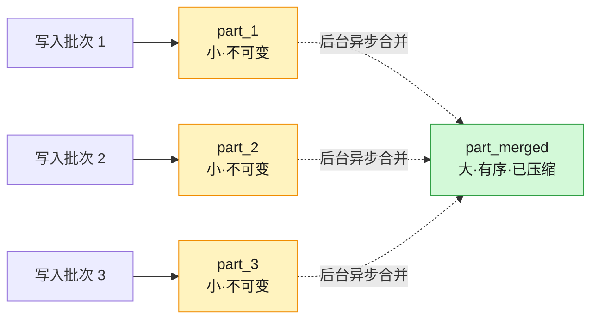
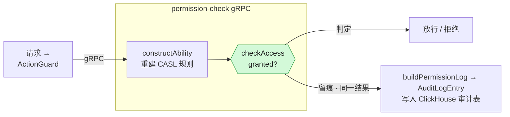
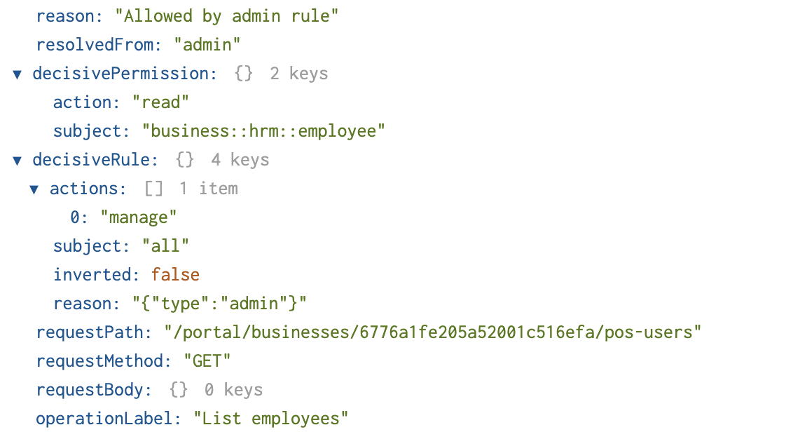
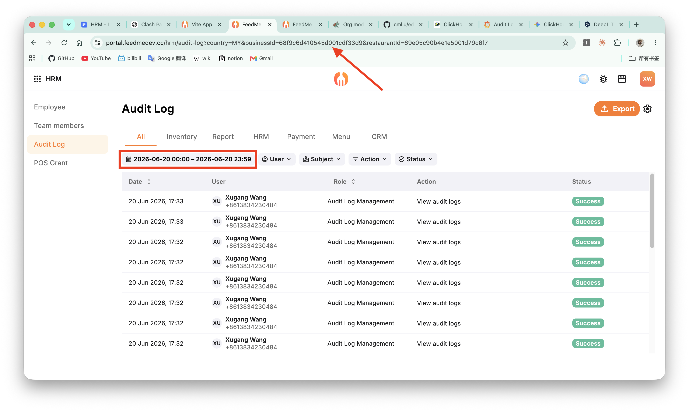
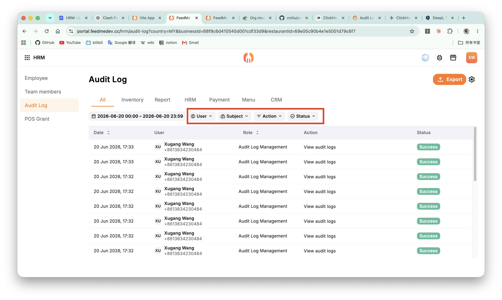
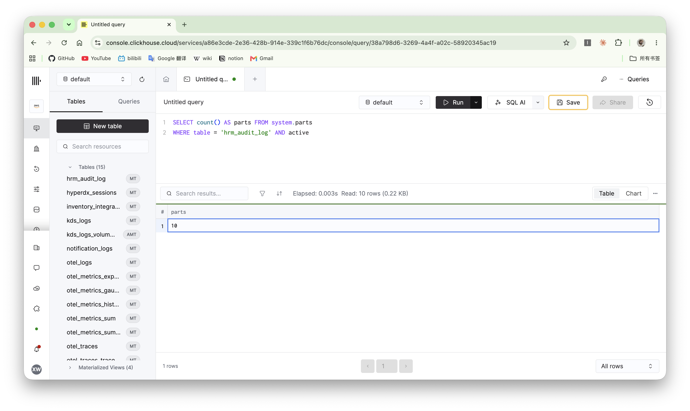

import Terminal from "./components/Terminal";
import Compression from "./components/Compression";
import Dictionary from "./components/Dictionary";

# ClickHouse：Mission Critical Audit Logs

A single change to a schedule, a single toggle of permissions—at the moment, it’s just another ordinary entry in the system; but a few months later, it might suddenly become the question everyone is asking: “Who changed this restaurant’s menu three months ago?” The answer lies in the audit log, but ensuring that it’s preserved and retrievable requires a revolution in storage and querying

This article covers the following topics:

- ClickHouse and Audit Log
- Two issues I ran into in production, and the thinking they prompted

<!--truncate-->

## Origins

I am currently working on the hrm-service at FeedMe. FeedMe is an **operating system** for the F&B Industry: from ordering to kitchen, from scheduling to settlement, the entire system handles approximately 3 million operations every day: orders, payments, menu changes, employee actions, inventory changes, and report generation—all of which are ultimately recorded here

Hrm-service handles all the aspects related to 'people': employees, roles, permissions, passcodes, and scheduling (timesheets). Every sensitive action here must first pass an authorization check: the backend defines capabilities using CASL, each API endpoint is annotated with the `@Action({action, subject, condition, operationLabel})` decorator, and then `ActionGuard` intercepts the request to determine whether the user is authorized to perform the action. The result of this check—whether `allowed`, `denied`, or `skipped`—along with who (`userId`), what (`subject`), and what action (`action`) was taken, is recorded verbatim in an audit log. In other words, **auditing is not a bolted-on feature; it is baked into every protected interface**

These records are usually invisible, buried among the tens of thousands of daily audits, and no one ever gives them a second glance. Until one day, one of them suddenly becomes the most pressing issue in the conference room: Who changed this store’s permissions three months ago? Who approved that schedule adjustment, and what was it before the change? Questions like these never come with warning; when they arise, the answer is either there or it isn’t.

3 million operations may sound like a lot, but when broken down to operations per second and considered alongside the throughput of modern databases, this volume isn’t actually that daunting. **What truly changes everything is never peak traffic. The challenge is time**

Relevant regulations in Malaysia generally require that sales and audit-related data be retained for seven years. Anyone can keep a month’s worth of data, but retaining every single transaction exactly as it was for seven full years—and ensuring it can be retrieved and audited on any given day during that period—is a matter of an entirely different magnitude.

Here comes the dilemma:

- **Data is too expensive to hoard**: Storage costs scale linearly over time. A seven-year retention requirement will bankrupt any "store now, ask questions later" architecture, inevitably forcing a painful purge of historical data
- **Cold data is too slow to query**: Even if you manage to retain all that data, traditional row-based storage chokes on queries like "show me all permission changes for Store X from three years ago," grinding down to speeds no one is willing to wait for
 
Lose history, or lose its usefulness—take your pick.

失去历史, 或失去用处, 二选一

## ClickHouse & Audit Log

ClickHouse 恰好是为打破这个二选一而生的。把审计日志的特征摊开来看, 会发现它和 ClickHouse 的设计几乎严丝合缝

| 审计日志特点               | ClickHouse 优势                                |
| -------------------------- | ---------------------------------------------- |
| 字段重复率高               | 列式存储 + 压缩                                |
| 不可变, 仅追加写入         | MergeTree 引擎                                 |
| 临时查询为主, 难以预建索引 | 原生 OLAP 查询能力/可以对原始数据执行 SQL 操作 |

### 列式存储 & 压缩

最直接的红利来自列式存储。要理解它为什么对审计日志这么关键, 得先看一次典型的审计查询要查询什么——「过去一个月这家店的权限变更」, 它过滤的是 `businessId`, `subject`, `timestamp`, 最后也只取这么几列。传统行式存储把一整行的所有字段连续摆在一起, 哪怕只问三列, 磁盘也得把每一行整条读出来再丢掉大半；列式存储反过来, 把同一列的值连续排布, 查询几列就只读几列, 其余字段安安静静躺在磁盘上不被打扰

而列式存储真正的杠杆在压缩。同一列的值连续排布, 排序之后, 相同的值彼此相邻——审计日志的字段重复率又高得惊人：`subject`, `action`, `outcome`, `country` 这些字段, 在几百万行里翻来覆去也就那么几十个取值。这种连续的重复模式, 正是压缩算法最爱啃的骨头。ClickHouse 官方 docs 里跑过一份 Stack Overflow `posts` 表的基准：低基数列的压缩比能冲到 27 倍(`PostTypeId`), 甚至上千倍(`FavoriteCount` 高达 1853 倍)。审计日志的形状比那还要规整, 压缩空间只多不少

<Compression />

在自动压缩之上, 还有两层可以手动加的杠杆

第一层是 `LowCardinality(String)`, 思路是字典编码(哈希表)：把一列里反复出现的字符串收进一张小字典, 行里只存指向字典的整数下标。审计日志几乎每一列都像是为它量身定做的

- `action` 死死锁在 CASL 的 `manage / create / read / update / delete` 五个动作上
- `subject` 是 `::` 分层的资源名(`business::hrm::teamMember`, `business::menu::item`, ...)
- `country` 是 ISO 国家码, 来回也就那几十个取值

把这些列从裸 `String` 换成 `LowCardinality(String)`, 再叠一层 `ZSTD`, 几乎是白捡的压缩

<Dictionary />

第二层是给特定形状的列挑专门的 **CODEC** (coder/decoder)。最典型的是时间戳：`timestamp` 是单调递增的序列, 相邻两条记录的差值往往只有几秒, 存差值远比存绝对值划算——这正是 `Delta` 编码的用武之地, 它先把序列转成一串小差值, 再交给 `ZSTD`([*Zstandard*](https://github.com/facebook/zstd)) 去压。官方对可观测性数据的建议很直白：「`ZSTD` all the way」, 字符串, 数值列统统上 `ZSTD`, 时间戳再额外加一层 `Delta`。几样叠起来, 同一份审计数据的落盘体积能压到行式存储的零头

### MergeTree

写入模式也契合。审计日志本质上是 immutable 的——一条记录一旦落库就**不该**再改, 它不像业务表那样有「更新某个字段」的需求, 只会随着时间不断追加新行。这种「只增不改」的形式, 恰好是 ClickHouse `MergeTree` 引擎的设计理念

`MergeTree` 的工作方式简单说就是「先快写, 再慢合」。每一批写入都按排序键(`ORDER BY`)排好序, 落成磁盘上一个独立的, 不可变的 part——这一步是纯顺序写, 极快。之后后台再异步地把小 part 合并成大 part, 顺手做整理与压缩。查询时它靠的是一份稀疏主键索引(默认 `index_granularity = 8192`, 每 8192 行才留一个标记), 配合排序键快速跳过整段无关数据, 而不必像 B-Tree 那样为每一行维护索引。对一张只增不改, 按时间和 `businessId` 天然有序的审计表来说, 这套机制几乎不费力



### OLAP

最后是 OLAP (Online Analytical Processing) 查询能力, 而这恰恰是审计场景最吃紧的地方。审计里最棘手的从来不是高频的固定查询, 而是那些临时调查(ad hoc investigation)：「谁在三个月前改了这家店的权限」「这个被拒绝的操作之前, 那个账号还做过什么」——没人能提前预测会被问到什么, 自然也无从为它预建索引

传统的行式 OLTP (Online Transaction Processing)数据库擅长的是「精确点查一行, 再改掉它」, 可一旦问题变成「扫过去三年某家店的全部权限变更, 再按人聚合」, 它就得逐行翻遍整张表, 慢到没人愿意等。ClickHouse 是为这类问题而生的——列式存储让它只读相关的几列, 向量化执行让它一次处理一整批数据, 几亿行的聚合也能压到秒级。换句话说, 它允许你直接用 SQL 在原始审计数据上提问, 而不必为每一种可能的提问预先铺好路

开头那个会议室里的问题, 实际的 SQL 上不过是几行——给定一家店, 过去一个月里谁动过它的权限, 哪些尝试被拒绝了：

```sql title="investigate.sql"
SELECT timestamp, userId, action, outcome
FROM hrm_audit_log
WHERE businessId = 'biz_8f2c'
  AND subject = 'business::hrm::teamMember'
  AND timestamp >= now() - INTERVAL 1 MONTH
ORDER BY timestamp DESC
```

运行结果如下：

<Terminal />

## 拆开一条审计日志

### 从 @Action 到落库

先来介绍一下审计日志, 它的入口是一个装饰器——每个受保护的接口都挂着 `@Action`, 声明这次操作的 `level`（`0/1/2`, 对应 FeedMe / Business / Restaurant 三个层级）, `subject`, `action`, `condition` 以及一个 `operationLabel`：

```ts title="timesheet.controller.ts"
@Action({
  level: Permission.Level.restaurant,
  subject: Permission.Subject.Business.hrm_employee,
  action: Permission.Action.read,
  operationLabel: 'View timesheets',
})
```

除了静态的 Str, `operationLabel` 还可以传入函数, 按请求体动态生成——portal-user 接口上就写着 `Add new team member: {email}`, pos-role 上是 `Add new employee role: {name}`, 运行时把真实的邮箱, 角色名填进去, 各个使用者可以根据业务需求定制自己的 `operationLabel` 模板, 让审计日志里记录的操作更具可读性, 也更方便后续调查时的搜索和过滤

请求进来, `ActionGuard` 读出 `@Action` 元数据, 连同 `userId`, `businessId`, `restaurantId`, 请求路径与方法, 一起发送给后端。真正干活, 也真正写审计的, 是另一头那个独立的 permission-check gRPC 服务——它用 `constructAbility` 重建这个人的 CASL 规则, 跑 `checkAccess` 得出 `granted`/`denied`, 再调 `buildPermissionLog` 把结果打包成一条 `AuditLogEntry`, 最后写进 ClickHouse



**判定与留痕同源**：放行与否的那次计算, 和写进审计表的那条记录, 出自同一份 `checkAccess` 结果, 不存在「日志和实际行为对不上」的缝隙

### 日志里装了什么

最初版本的日志表如下：

```sql title="hrm_audit_log Clickhouse DB schema"
CREATE TABLE default.hrm_audit_log (
  `timestamp` DateTime,
  `userId` String,
  `subject` String,
  `action` String,
  `field` Nullable(String),
  `businessId` Nullable(String),
  `restaurantId` Nullable(String),
  `country` Nullable(String),
  `outcome` Enum8('allowed' = 1, 'denied' = 2, 'skipped' = 3),
-- highlight-next-line
  `metadata` String
)
ENGINE = MergeTree
ORDER BY (timestamp, userId)
SETTINGS index_granularity = 8192
```

值得单独说一句的是 `metadata` 里装的东西。它不只记下「结果是 allowed 还是 denied」, 更记下**为什么**：`resolvedFrom` 标明这次判定是被哪一类规则命中的（`admin`, `staff`, `permissionSet`, `systemPermissionSet`, 或者干脆 `no-match`）, `decisiveRule` 和 `decisivePermission` 钉住那条起决定作用的具体规则, `trace` 留下推导的面包屑, 外加 `requestPath`, `requestMethod`, `operationLabel`。普通日志告诉你「门没开」, 这条记录能告诉你「是哪把锁, 按的哪条规矩没开」——这正是审计区别于排障日志的地方

比如下面就是一个样例：

Permission Granted:



Permission Denied:


接下来讲两个实际遇到的 bug

## Bug 1 - Order By 导致的性能问题

第一版 schema 是在还没真正想清楚「这张表会被怎么查」的时候定下的——`ORDER BY (timestamp, userId)`, 单纯按时间和用户排序。这在 ClickHouse 里是个代价很大的疏忽, 因为 `ORDER BY` 在 `MergeTree` 里不只决定数据在磁盘上的物理顺序, 它同时就是主键, 决定了那份稀疏索引能帮查询跳过多少数据。换句话说, 排序键选得对不对, 直接决定了一条查询是「跳到几个 granule」还是「翻遍整张表」

而我们真实的查询模式, 和这个排序键几乎是错位的。审计日志的入口是一个后台界面, 用户第一步永远是「选一家商户, 圈一段日期」——也就是先按 `businessId` 过滤, 再按 `toDate(timestamp)` 圈定天级范围:



在这之上, 才是各种次级过滤: 按 `subject` 看某类资源, 按 `action` 看某种操作, 按 `userId` 锁定某个人, 按 `outcome` 只看被拒绝的:



问题就出在这里。`businessId` 是每条查询都必带的第一过滤维度, 却压根不在排序键里; 而排在键首位的 `timestamp` 是秒级精度, 基数高到几乎每行都不一样, 对「圈一段日期」这种范围过滤也帮不上多少忙。结果是, 哪怕只查一家商户一周的数据, ClickHouse 也只能近乎全表扫描, 再把不匹配的行一行行丢掉——表越大, 这一刀砍得越疼

修复的方向很直接: 让排序键照着真实的过滤顺序来排。把每条查询都必带的 `businessId` 提到最前, 紧接着是对应日期范围过滤的 `toDate(timestamp)`(用 `toDate` 而非裸 `timestamp`, 是因为查询按天圈定, 天级基数远低于秒级, 前缀跳过更高效), 再把 `action`, `subject`, `userId` 这些次级过滤维度依次跟上, 最后才补一个原始 `timestamp` 收尾排序:

```sql title="Fix Order By"
  CREATE TABLE default.hrm_audit_log (
    `timestamp` DateTime,
    `userId` String,
    `subject` String,
    `action` String,
    `field` Nullable(String),
    `businessId` Nullable(String),
    `restaurantId` Nullable(String),
    `country` Nullable(String),
    `outcome` Enum8('allowed' = 1, 'denied' = 2, 'skipped' = 3),
    `metadata` String
  )
  ENGINE = MergeTree

-- git-remove-next-line
- ORDER BY (timestamp, userId)
-- git-add-next-line
+ ORDER BY (businessId, toDate(timestamp), action, subject, userId, timestamp)
  SETTINGS index_granularity = 8192
```

这样一来, 「某个商户, 某段日期, 某类操作」这类查询, 从排序键的最左前缀就能一路命中, ClickHouse 直接定位到相关的 granule, 跳过绝大部分无关数据。改完之后, 同样的查询不必再扫全表, 延迟肉眼可见地降了下来

这背后其实是 ClickHouse 选 `ORDER BY` 的一条通用准则: 把查询里最常用, 最能缩小范围的过滤列放在排序键的最左边。这里也有一个需要诚实交代的取舍——官方建议排序键尽量按基数升序排列, 而 `businessId` 的基数并不算低, 把它强行提到首位, 是用一点压缩率和理论上的最优, 去换「几乎每条查询都按 business 过滤」这个真实访问模式下的数据跳过。排序键的价值, 永远是相对访问模式而言的, 脱离查询谈排序键没有意义

## Bug 2 - 合并策略

上一个 bug 是「数据怎么排」, 这一个是「数据怎么写进去」。我们拿到一条判定结果后, 写入 ClickHouse 用的是官方的 `@clickhouse/client`, 调用长这样：

```ts title="permission-check-grpc.controller.ts"
this.auditLogService
  .insertLogs([
    {
      timestamp: logEntry.timestamp.toISOString(),
      userId: logEntry.userId,
      subject: logEntry.subject,
      action: logEntry.action,
      outcome: logEntry.outcome,
      metadata: JSON.stringify(logEntry.metadata),
      // ...businessId / restaurantId / country / field
    },
  ])
  .catch((err) => this.logger.error('Failed to insert audit log', err));
```

这里埋了一个坑：每过一次权限校验, 就单独 `insertLogs()`, 而且是 fire-and-forget——不 `await`, 错误也只是 catch 进了日志。功能上没毛病, 性能上却正好踩在 ClickHouse 最忌讳的地方：逐行写入是它的头号反模式

要理解为什么, 得先看一次 insert 在 `MergeTree` 里到底发生了什么。每一次 insert, 不管写的是一行还是一百万行, 都会生成一个独立的 part——一个实打实的磁盘目录, 带着自己的列文件, 稀疏索引, min/max 标记和一堆元数据。一行一个 part, 等于用一整套目录结构去包一行数据, 开销比数据本身还大。更要命的是后台那些 merge 线程：它们要不停地把小 part 两两合并成大 part, 而逐行写入制造 part 的速度, 远比合并消化它们的速度快——part 越堆越多, 合并越来越喘

到了我们这个量级, 这就不是「慢一点」, 而是「会炸」。ClickHouse 对每个分区的活跃 part 数有硬上限(`parts_to_throw_insert`, 默认 300), 一旦越过, 新的写入会被直接拒绝, 抛出 `TOO_MANY_PARTS`。每天 300 万次校验, 每次一个 part, 这个上限根本撑不了多久; 而且 part 越多, 查询要打开, 扫描的文件也越多, 读和写会一起被拖慢

修复的核心思路就是攒。把零散的逐行写入, 拢成「大批量, 少批次」, 正好顺着 ClickHouse 喜欢的方向。具体有两层做法

一是应用侧攒批：在内存里把多条日志缓冲起来, 凑够一定行数, 或隔一小段时间, 再一次性 insert

二是更省事的服务端方案——打开 `async_insert = 1`, 让 ClickHouse 自己在服务端缓冲收到的行, 到达阈值(`async_insert_max_data_size` 或 `async_insert_busy_timeout_ms`)再统一刷成一个 part。客户端可以照旧一行一行地发, 攒批这件脏活全交给服务端; 再配合 `wait_for_async_insert = 0`, 还能保留原来那种 fire-and-forget 的手感。官方的 OpenTelemetry exporter 默认走的就是 async_insert, 对我们这种「只追加, 能容忍秒级延迟」的审计写入再合适不过

改前改后, 用 `system.parts` 一查活跃 part 数, 差距一目了然：

```sql
SELECT count() AS parts FROM system.parts
WHERE table = 'hrm_audit_log' AND active
```



## 后记

把 audit log 当成产品基础设施, 意味着它的 schema, 留存策略, 查询接口, 都要按「会被产品直接消费」的标准来设计, 而不再只是工程师私下约定的格式。这件事一旦想清楚, 往后很多决策都会不一样