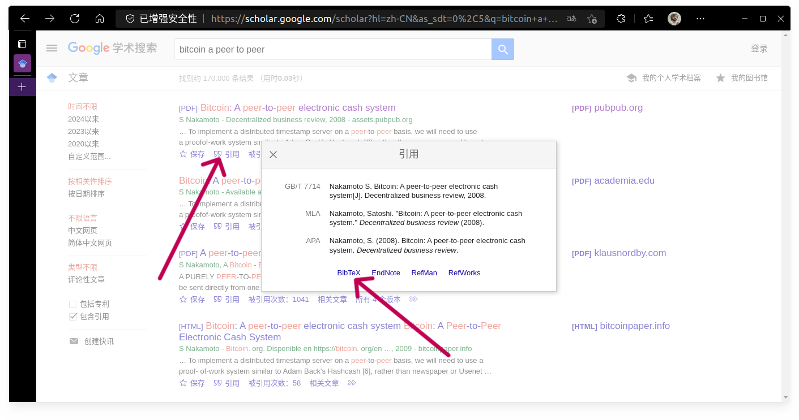
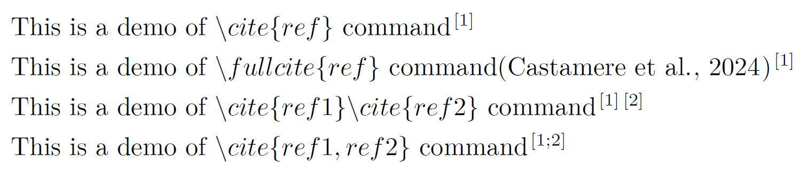
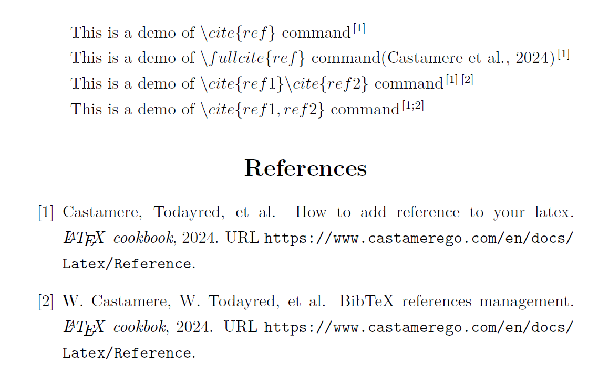
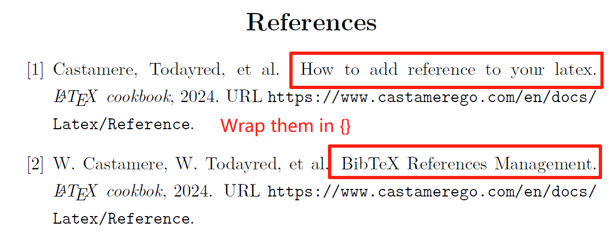

# Latex References

Use **BibTeX** for **References** management

## Preface

This article introduces how to add references in $ \large \LaTeX $. The tutorial includes following contents:

- A full tutorial on BibTeX reference management
- How to compile LaTeX documents with BibTeX
- How to modify the format of in-text citations
- How to modify the format of the "References" section at the end
- A complete demo on above contents
- FAQs and solutions related to BibTeX

:::tip
Please make sure you can compile LaTeX Projects before proceeding

For Your Information, you need to(suggested):
- Install TeXworks
- Use VS Code for writing and compiling
- Install LaTeX Workshop plugin in VS Code
:::

Now let's dive in

## BibTeX References Management

$ \Large \mathrm {B\mathbf {\scriptstyle \text{IB}}} \TeX $ is a *Bibliography Management Tool* used for formatting reference lists. Its name originates from the word $(bibliography)$ and $\TeX$ formatting tool. Using BibTeX to manage your bibliography includes the following steps, I suggest you [click here](./demo/01-reference.zip) to download the demo and follow the guide below

1. Create a BibTex database file (`.bib` file)
2. Add reference entries in the `.bib` file
3. Set the format of in-text citations and references
4. Use commands to cite references in the article
5. Use commands to list references at the end of the article

### Step 1: Create a BibTeX database file

First, I suggest the following project structure: After opening the project root folder with VS Code, create a `thesis.tex` file in the root directory, create a `references` **folder** and create a `references.bib` file within

And it's for the best to create a **workspace settings file** in VS Code, which means creating a `.vscode` folder and a `settings.json` file within it to modify workspace settings

There are two reasons for this: 

first, under different requirements, you may need to use different compilation orders, which allows each project to run normally without affecting global settings

Second, when moving the project to other devices or sharing it with others, we can make sure it still compiles in the way we expect

```txt title="TL,NR;"
Project Structure:
│  thesis.tex
│
├─.vscode
│       settings.json
│
└─references
        references.bib
```

### Step 2: Add Reference Entries to the `.bib` File

`.bib` file is a JSON-like file format. It contains a series of entries, each representing a reference, and stores detailed information about the reference in a specific format. Each entriy starts with a format like:

```bibtex
@type{citation_key,
    key1 = {value1},
    key2 = {value2},
    ...
}
```

:::info
The format of a BibTeX reference entry typically starts with `@type`, The type might be `@article`, `@book`, `@inproceedings`, etc.

And then follows a set of curly braces. Inside these curly braces, the first field is a unique identifier `key`, It allows you to cite the reference in the article using the command `\cite{key}`

The rest of the entry consists of various attributes in key-value pairs, providing detailed information about the reference
:::

In the [Common BibTeX Reference Types](#bibtex-reference-types) section, I listed the reference standards and BibTeX reference types. Below is an example of the `.bib` file in the demo:

```txt
@article{Castamere2024AddReference,
  author  = {Castamere and Todayred and others},
  title   = {How to add Reference to your LaTeX},
  journal = {\LaTeX \enspace cookbook},
  url     = {https://www.castamerego.com/en/docs/Latex/Reference},
  year    = {2024}
}

@article{Castamere2024HowToAdd,
  author  = {W. Castamere and W. Todayred and others},
  title   = {{BibTeX References Management}},
  journal = {\LaTeX \enspace cookbok},
  url     = {https://www.castamerego.com/en/docs/Latex/Reference},
  year    = {2024}
}
```

To new beginners, there are some faqs about the format of `.bib` file, which can be found in the [BibTeX FAQs](#bibtex-faqs) section

Next, the problem is to find BibTeX format references. [Google Scholar](https://scholar.google.com) provides BibTeX format references. You can first find some papers on other websites or platforms (such as some AI paper review websites: [semless](https://seaml.es/science.html)). Then search these articles directly in [Google Scholar](https://scholar.google.com), click `Cite`, and find `BibTeX` in the pop-up box. Click it to get the BibTeX format reference, which can be copied directly and added to the `.bib` file



### Step 3: Set the Format of Citations and References

Here I separate this step into three parts

- Modify the format of how the references are listed (e.g., journal style: author. title [J]. journal name, year, volume (issue): page range)
- Modify the format of in-text citations (e.g., whether it shows as [1], (1), or (Castamere et al., 2024)[1])
- Modify the format of the final References text (e.g., whether it shows as "References" or "Bibliography", and modify font and size)

#### Modify the format of how the references are listed

When using `BibTeX`, you need to import the `hyperref` and `natbib` packages. Use the `\bibliographystyle{}` command to change the style of how references are listed. Common styles are listed below, and if there are no special requirements (e.g., just for a small assignment), it is recommended to use `unsrtnat`, which lists references in the order they are cited

```latex
\RequirePackage{natbib}          % BibTeX library
\usepackage[hidelinks]{hyperref} % for hyperlinks
\bibliographystyle{unsrtnat}     % reference style
```

- plainnat: `author - year` format, and sorted by author's last name
- abbrvnat: Similar to plainnat, but names and months are abbreviated
- unsrtnat: `author - year` format, but references are listed in the order they are cited
- apalike: APA format, such as the style of publications by the American Psychological Association
- alpha: `author - year` format, but uses a label system based on author's last name and publication year, not a complete author-year citation format

#### Modify the format of in-text citations

:::tip
The following examples use the `unsrtnat` style in the demo
:::

Use `\bibpunct` to modify the style of in-text citations. The first two parameters are the bracket styles, normally using square brackets or parentheses. The third parameter is the separator for multiple references. You can also use `\newcommand` to define custom citation commands

```latex
%  The first and second parameters are bracket styles, which can be replaced with parentheses.
\bibpunct{[}{]}{;}{s}{,}{,} 
\newcommand{\fullcite}[1]{(\citeauthor{#1}, \citeyear{#1})\cite{#1}} % Custom reference commands
```

#### Modify the format of the final References text

To modify the final `References` text, you can use the `\renewcommand` function. It rewrites an existing function, where the first parameter is the name of the existing function, and the second parameter is the specific implementation of the function.

:::note
Add this command after `\RequirePackage{natbib}`
:::

```latex
\RequirePackage{natbib}

% display "Bibliography" in the center, with a custom font size
% \sihao is a custom font size 
\renewcommand{\refname}{\begin{center} \sihao Bibliography \end{center}}

% Or maybe display "References" in the center
\renewcommand{\refname}{Reference}
```

### Step 4: Use Commands to Cite References in the Article

You can use the `\cite` command to cite references in the article. The parameter is the citation key defined in the `.bib` file. To cite in the format of (Castamere et al., 2024)[1], I have written a custom command `\fullcite` for you to use, as shown in the following example. Readers can study it in the [Demo](./demo/01-reference.zip)

```latex
\newcommand{\fullcite}[1]{(\citeauthor{#1}, \citeyear{#1})\cite{#1}} % Custom reference commands
```



### Step 5: Use Commands to List References at the End of the Article

Now that we have cited references in the article, we need to list them at the end. In LaTeX, we can use the `\bibliography` command to list all references. The parameter is the **relative** path of the `.bib` file, **without the file extension**

- ✔ references/references
- ✖ references/references.bib

But this command does not automatically add a "References" to your table of contents (TOC). To do this, you can use the `\phantomsection` command to create a phantom section. 

This trick allows you to add an entry to the TOC without actually creating a visible section in the document, such as References, Abstract, Keywords, Appendix, etc., where you don't want to use the `\section` command

```latex
% Add "References" to TOC
\phantomsection\addcontentsline{toc}{section}{Reference}

% List all references
\bibliography{references/references}
```

## Full Demo

[Click here to download Demo](./demo/01-reference.zip)

I provide a simple demo here. After installing `Texworks`, using `VS Code`, and installing the `latex-workshop` plugin, you can compile it directly



```txt
Project Structure：
demo-01-reference:
│  templates.pdf
│  templates.tex
│
├─.vscode
│       settings.json
│
└─references
        references.bib
```


<details>
  <summary>Demo</summary>

```latex showLineNumbers title="Demo"
% Author: Castamere
\documentclass{ctexart}

\RequirePackage{natbib}          % BibTeX library
\usepackage[hidelinks]{hyperref} % for hyperlinks
\bibliographystyle{unsrtnat}     % reference style
\bibpunct{[}{]}{;}{s}{,}{,} %  The first and second parameters are bracket styles, can be replaced with parentheses.
\newcommand{\fullcite}[1]{(\citeauthor{#1}, \citeyear{#1})\cite{#1}} % Custom reference commands

\pagestyle{empty} % Remove headers, footers, etc. that are not related to the citation.
\renewcommand{\refname}{References}

\begin{document}

% Use \cite{} to cite a reference
This is a demo of $\backslash cite\{ref\}$ command\cite{Castamere2024AddReference} 

% Use custom command \fullcite{} to cite a reference
This is a demo of $\backslash fullcite\{ref\}$ command\fullcite{Castamere2024AddReference} 

% Cite multiple references separately
This is a demo of $\backslash cite\{ref1\}\backslash cite\{ref2\}$ command\cite{Castamere2024AddReference}\cite{Castamere2024HowToAdd}

% Cite multiple references together
This is a demo of $\backslash cite\{ref1, ref2\}$ command\cite{Castamere2024AddReference, Castamere2024HowToAdd}

\phantomsection\addcontentsline{toc}{section}{References} % Add “References” to TOC

\bibliography{references/references} % Use \bibliography{} to list all refs

\end{document}
```

</details>

## How to Compile LaTeX Documents with BibTeX

One simple, plain text article that needs LaTeX for formatting, when it contains Unicode characters like Chinese, only compile **once** with XeLaTeX should be necessary

But when writing a thesis or paper, the two most important reason we use Latex: Figure/Table numbering and citation, reference citation, requires a more complex compilation process

:::info
XeLaTeX(XƎTEX) is a Unicode-based TeX typesetting engine

XeLaTeX is a TeX typesetting engine using Unicode and supporting modern font technologies such as OpenType, Graphite and Apple Advanced Typography (AAT). 

Therefore, users can easily use different fonts, including multi-byte character sets such as Chinese, Japanese, and Korean.
:::

To complete figure numbering and referencing, and reference citations, the compilation configuration I use is as follows: `xelatex -> bibtex -> xelatex -> xelatex`. The detailed content can be found in `.vscode/settings.json` in the [Demo](./demo/01-reference.zip), and also in the `latex-workshop configuration` section at the end of this article. Readers who are not concerned about the underlying logic can directly use it

### Compilation Logic

`xelatex -> bibtex -> xelatex -> xelatex`

The 1st `xelatex` compile:  `xelatex` processes the LaTeX source file and generates an auxiliary file (`.aux` file), which contains labels for figures, equations, and references. However, at this stage, **cross-references are not resolved**, so they appear as question marks (?)

`bibtex` compile: we process the `.aux` file, and based on the citations (e.g., `\cite{...}` commands) in it, we look up the corresponding entries in the `.bib` file to generate a bibliography list (usually a `.bbl` file). This list will be included in the subsequent LaTeX compilation

The 2nd `xelatex` compile: we process the LaTeX source file again, this time it reads the `.bbl` file and inserts the correct references into the document. It also updates the cross-reference information in the `.aux` file

The 3rd `xelatex` compile: the final compilation is to ensure that all cross-references (including those appearing after references or figure numbering) are correctly resolved. Since cross-references may depend on bibliographic citations (which can affect the order of references), another compilation is needed to ensure everything is resolved, and all references in the document are correct

## VS Code Plugin latex-workshop Configuration

The content of `.vscode/settings.json` file

<details>
  <summary>latex-workshop Configuration</summary>

```json showLineNumbers title="latex-workshop Configuration" icon="vscode"
{
  "latex-workshop.latex.tools": [
    {
      "name": "xelatex",
      "command": "xelatex",
      "args": [
        "-synctex=1",
        "-interaction=nonstopmode",
        "-shell-escape",
        "-file-line-error",
        "-pdf",
        "%DOCFILE%"
      ]
    },
    {
      "name": "bibtex",
      "command": "bibtex",
      "args": ["%DOCFILE%"]
    }
  ],
  "latex-workshop.latex.recipes": [
    {
      "name": "Castamere",
      "tools": ["xelatex", "bibtex", "xelatex", "xelatex"]
    }
  ]
}
```

</details>

## BibTeX Reference Types

:::info
Following Are **Chinese** Standards
:::

### Reference Types and Identification Codes

According to **[GB/T 7714-2015 信息与文献 参考文献著录规则]**

| Type       | Code  | Type     | Code  |
| :--------- | :---: | :------- | :---: |
| 普通图书   |   M   | 会议录   |   C   |
| 汇编       |   G   | 报纸     |   N   |
| 期刊       |   J   | 学位论文 |   D   |
| 报告       |   R   | 标准     |   S   |
| 专利       |   P   | 数据库   |  DB   |
| 计算机程序 |  CP   | 电子公告 |  EB   |
| 档案       |   A   | 舆图     |  CM   |
| 数据集     |  DS   | 其他     |  ZB   |

| Type               | Code  | Type             | Code  |
| :----------------- | :---: | :--------------- | :---: |
| 磁带(magnetictape) |  MT   | 磁盘(disk)       |  DK   |
| 光盘(CD-ROM)       |  CD   | 联机网络(online) |  OL   |

### Bibtex Reference Types

**Journal [J]**

- @article

  Thesis in journal

  - necessary property: author, title, journal, year.
  - optional property: volume, number, pages, month, note.

**Monograph [M]**

- @book

  Publicly published books

  - necessary property: author/editor, title, publisher, year.
  - optional property: volume/number, series, address, edition, month, note.

- @incollection

  A chapter in a book

  - necessary property: author, title, booktitle, publisher, year.
  - optional property: editor, volume/number, series, type, chapter, pages, address, edition, month, note.

**Conference proceedings [A] in: [C]**

- @proceedings

  Conference proceedings

  - necessary property: title, year.
  - optional property: editor, volume/number, series, address, month, organization, publisher, note.

- @inproceedings

  equal to @conference

  - necessary property: author, title, booktitle, year.
  - optional property: editor, volume/number, series, pages, address, month, organization, publisher, note.

**thesis [D]**

- @mastersthesis

  Master's thesis

  - necessary property: author, title, school, year.
  - optional property: type, address, month, note.

- @phdthesis

  Doctoral thesis

  - necessary property: author, title, year, school.
  - optional property: address, month, keywords, note.

## BibTeX FAQs

### escape characters

Sometimes citation errors may occur due to special characters in the article name that need to be escaped in LaTeX, such as `_%&`. The most common issue is the bloody underscore causing compilation failure

| character | Latex command | character | Latex command |
| :-------: | :-----------: | :-------: | :-----------: |
|    \_     |     \\\_      |    \{     |     \\\{      |
|     %     |      \\%      |    \}     |     \\\}      |
|     &     |      \\&      |     ^     |      \\^      |
|     $     |      \\$      |     \     |  \backslash   |

### Case Sensitivity

Some fields in BibTeX, such as `title`, `booktitle`, etc., automatically convert letters in sentences to lowercase. To keep the original case, you can wrap the content in `{}`



```latex showLineNumbers
@article{Castamere2024AddReference,
  author  = {Castamere and Todayred and others},
  // highlight-start
  % The 'R' in 'Reference' and 'L', 'T', 'X' in 'LaTeX' will be converted to lowercase
  title   = {How to add Reference to your LaTeX},
  // highlight-end
  journal = {\LaTeX \enspace cookbook},
  url     = {http://www.castamerego.com/docs/Latex/reference},
  year    = {2024}
}

@article{Castamere2024HowToAdd,
  author  = {W. Castamere and W. Todayred and others},
  // highlight-start
  % Wrap the title in {} to keep the original case
  title   = {{BibTeX References Management}},
  // highlight-end
  journal = {\LaTeX \enspace cookbook},
  url     = {http://www.castamerego.com/docs/Latex/reference},
  year    = {2024}
}
```

[$ \Large \mathrm {B\mathbf {\scriptstyle \text{IB}}} \TeX $]: https://en.wikipedia.org/wiki/BibTeX
[Google Scholar]: https://scholar.google.com/
[GB/T 7714-2015 信息与文献 参考文献著录规则]: https://lib.tsinghua.edu.cn/wj/GBT7714-2015.pdf
[semless]: https://seaml.es/science.html
